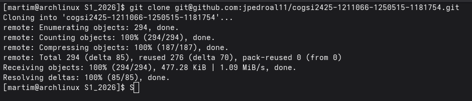
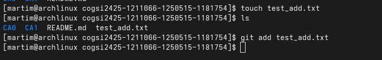
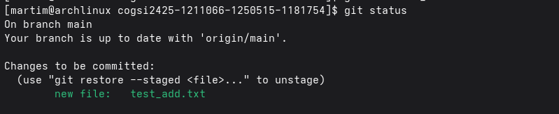
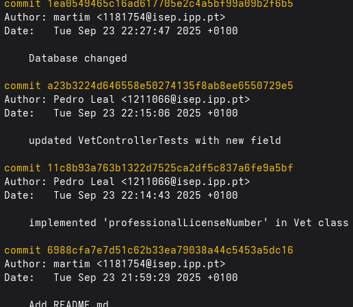
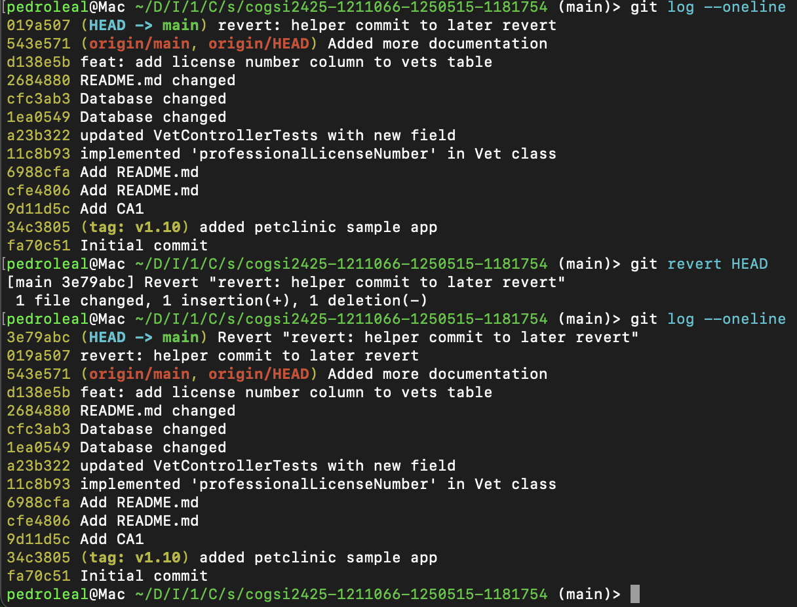
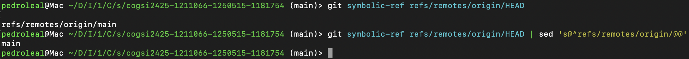
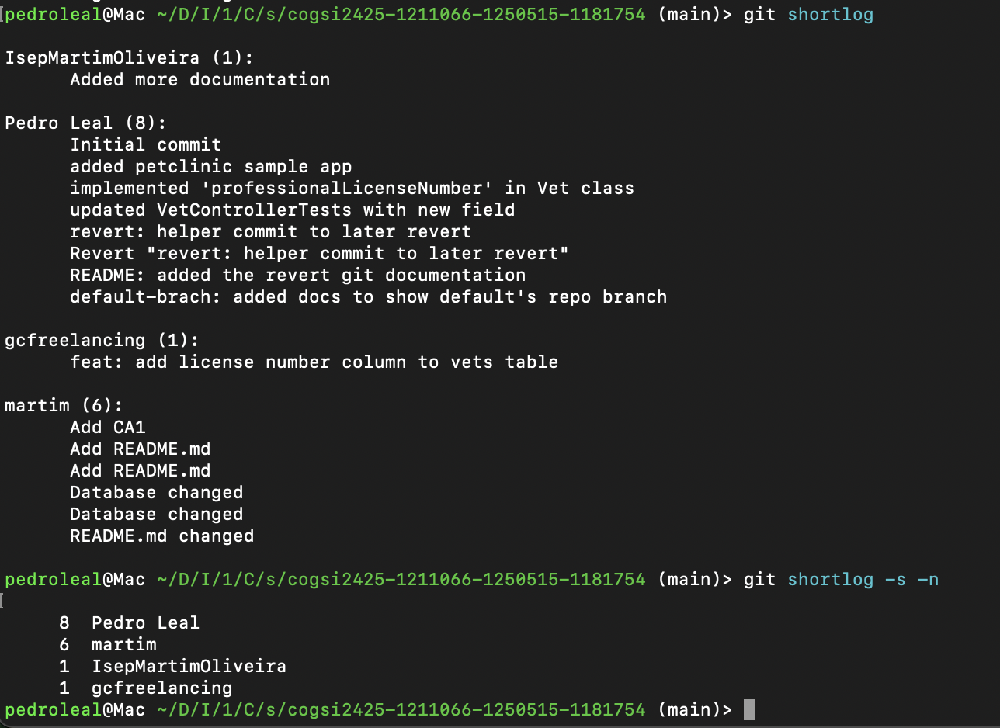
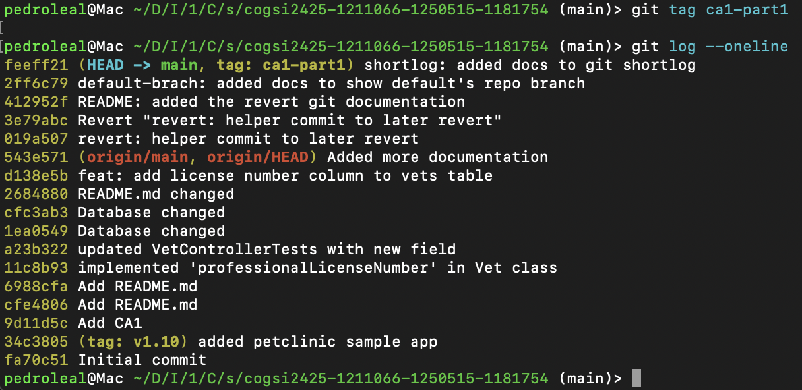

# Git

This repository is about **Git**.

Git is a distributed version control system that tracks changes in source code, enabling collaboration and history management.

## Basic Git Commands
- `git init`: Initialize a new Git repository.


- `git clone <repository-url>`: Clone an existing repository.



- `git add <file>`: Stage changes for the next commit.




- `git commit -m "message"`: Commit staged changes with a message.


- `git status`: Check the status of the working directory and staging area.
  



- `git log`: View the commit history.




- `git branch`: List, create, or delete branches.


## Exercise

1. Check current commit using
```
git log --oneline

```

This will return the commit hash and the commit message.

2. Create a tag with v1.1.0
```
git tag v1.1.0 34c3805

```
This will create a tag named v1.1.0 at the specified commit hash.


3. Add a value to Vet
```java
    private String professionalLicenseNumber;

```

Exercise requires to add a new attribute to Vet class

4. Added value to database

```
INSERT INTO vets VALUES (default, 'Rafael', 'Ortega','57484542342342');


CREATE TABLE vets (
  id         INTEGER GENERATED BY DEFAULT AS IDENTITY PRIMARY KEY,
  first_name VARCHAR(30),
  last_name  VARCHAR(30),
  professionalLicenseNumber VARCHAR(30)
);
```
Exercise requires to add a new column to vets table and insert a new vet with the new attribute

5. Added the commits

- Implemented 'professionalLicenseNumber' in Vet class
    - git add .
    - git commit -m "implemented 'professionalLicenseNumber' in Vet class"
    - git push

- Implemented 'Database changed' in Vet class
    - git add .
    - git commit -m "implemented 'Database changed' in Vet class"
    - git push

- Added license number column to vets table (Vet frontend)
    - git add .
    - git commit -m "add license number column to vets table"
    - git push


6. Identify the commit
```
   git log --oneline
```

7. Revert the commit

    In order to implement revert functionality, an helper commit was added to the repository

    

    In this specific case HEAD was used instead of the actual commit id as it was the last one, but this revert could also be done running this command:


    ```
    git revert 019a507
    ```
8. Show default branch and the last commit

    To identify the repository’s default branch, the following command was used:

     ```
    git symbolic-ref refs/remotes/origin/HEAD
    ```

    Extra: For a cleaner output:

     ```
    git symbolic-ref refs/remotes/origin/HEAD | sed 's@^refs/remotes/origin/@@'
    ```

        

9. Show distinct contributors

    To show the contributions done by each person, the following command was run:

     ```
        git shortlog
    ```
    
    To get a more simple log these flags were used:

    - '-s' to only show the number of commits by contributor;
    - '-n' to sort the ouput numerically; 

    ```
        git shortlog -s -n
    ```

    

10. At the end of the assignment mark your commit with the tag
ca1-part1

    ```
        git tag ca1-part1
    ```

    