# Git

This repository is about **Git**.

Git is a distributed version control system that tracks changes in source code, enabling collaboration and history management.

## Basic Git Commands
- `git init`: Initialize a new Git repository.


- `git clone <repository-url>`: Clone an existing repository.


- `git add <file>`: Stage changes for the next commit.


- `git commit -m "message"`: Commit staged changes with a message.


- `git status`: Check the status of the working directory and staging area.
  


- `git log`: View the commit history.


- `git branch`: List, create, or delete branches.


## Exercise

1. Check current commit using
```
git log --oneline

```

This will return the commit hash and the commit message.

2. Create a tag with v1.1.0
```
git tag v1.1.0 34c3805

```
This will create a tag named v1.1.0 at the specified commit hash.


3. Add a value to Vet
```java
    private String professionalLicenseNumber;

```

Exercise requires to add a new attribute to Vet class

4. Added value to database

```
INSERT INTO vets VALUES (default, 'Rafael', 'Ortega','57484542342342');


CREATE TABLE vets (
  id         INTEGER GENERATED BY DEFAULT AS IDENTITY PRIMARY KEY,
  first_name VARCHAR(30),
  last_name  VARCHAR(30),
  professionalLicenseNumber VARCHAR(30)
);
```
Exercise requires to add a new column to vets table and insert a new vet with the new attribute

5. Added the commits

- Implemented 'professionalLicenseNumber' in Vet class
    - git add .
    - git commit -m "implemented 'professionalLicenseNumber' in Vet class"
    - git push

- Implemented 'Database changed' in Vet class
    - git add .
    - git commit -m "implemented 'Database changed' in Vet class"
    - git push

- Added license number column to vets table (Vet frontend)
    - git add .
    - git commit -m "add license number column to vets table"
    - git push


6. Identify the commit
```
   git log --oneline
```

7. Revert the commit

    In order to implement revert functionality, an helper commit was added to the repository

    

    In this specific case HEAD was used instead of the actual commit id as it was the last one, but this revert could also be done running this command:


    ```
    git revert 019a507
    ```
8. Show default branch and the last commit

    To identify the repository’s default branch, the following command was used:

     ```
    git symbolic-ref refs/remotes/origin/HEAD
    ```

    Extra: For a cleaner output:

     ```
    git symbolic-ref refs/remotes/origin/HEAD | sed 's@^refs/remotes/origin/@@'
    ```

        

9. Show distinct contributors

    To show the contributions done by each person, the following command was run:

     ```
        git shortlog
    ```
    
    To get a more simple log these flags were used:

    - '-s' to only show the number of commits by contributor;
    - '-n' to sort the ouput numerically; 

    ```
        git shortlog -s -n
    ```

    

10. At the end of the assignment mark your commit with the tag
ca1-part1

    ```
        git tag ca1-part1
    ```

    

11. Add an email field for a vet, so let’s  first create a branch named after the feature:

        

12. Create the email field and database

```java

 private String email;

```


13. It was commited and pushed to the email-field branch


    


14. It was tested to see if it is ok

    


15. Then it was merged into main


```
git checkout main && git pull origin main && git merge email-field && git push origin main
```
- `git checkout main`  
  Switches to the `main` branch.

- `git pull origin main`  
  Updates your local `main` with the latest changes from the remote repository.

- `git merge email-field`  
  Merges the changes from the `email-field` branch into `main`.

- `git push origin main`  
  Pushes the updated `main` (now with merged changes) back to the remote repository.


16. Create a tag for v1.3.0

```
git tag v1.3.0

git push origin v1.3.0
```

17. Merge confilcts

There are 2 branches in our repo, 'main' and 'email-field'. As main was already 1 commit ahead of 'email-field', I just edited the file with current changes in 'main' and ran:

```
git merge main
```

As you can see in the print below, I got conlficts as expected and then procedeed to vscode to handle the merge conflicts


The image below is the actual conflict in vscode:


I added a simple line: "MERGE CONFLICT" to purposely cause this merge conflict. And finalised by accepting the incoming changes from main after running.

18. Which local branch is configured to track which remote
branch?

    To check which local branches are tracking which remote branches, the folowing command was run:

    ```
    git branch -vv

    ```

    

19.At the end of the assignment mark your commit with the tag
ca1-part1

    ```
    git tag ca1-part2

    git push origin ca1-part2

    ```

# Fossil - Git Alternative

Fossil is a distributed version control system with built-in wiki, bug tracking, and web interface capabilities.

## Installation

### Windows Installation

**Step 1: Download Fossil**
  1. Go to: https://fossil-scm.org/home/uv/download.html
  2. Download **fossil-w64-X.X.zip** (64-bit Windows version)
  3. Extract the ZIP file to `C:\fossil\`
  4. You'll get a single file: `fossil.exe`

**Step 2: Add to PATH**
  1. Press `Windows + X` and click "System"
  2. Click "Advanced system settings"
  3. Click "Environment Variables"
  4. Under "User variables", find "Path" and click "Edit"
  5. Click "New" and add: `C:\fossil`
  6. Click "OK" on all dialogs

**Step 3: Verify Installation**

Open a NEW Command Prompt and run:

  ```
  C:\> fossil version
  This is fossil version 2.23 [abc123] 2024-01-15 12:34:56 UTC
  ```

If you see the version output, Fossil is installed correctly!

## Basic Fossil Commands

  - `fossil init <repository.fossil>`: Initialize a new Fossil repository.

  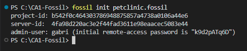

  - `fossil open <repository.fossil>`: Open a repository in the current directory.
  
  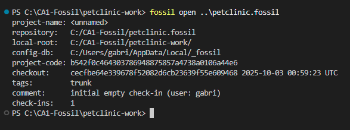
  
  - `fossil add <file>`: Add files to be tracked.
  
  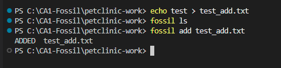
  
  - `fossil commit -m "message"`: Commit changes with a message.
  
  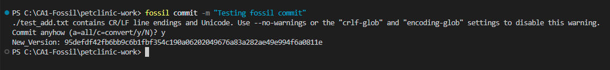
  
  - `fossil status`: Check the status of the working directory.
  
  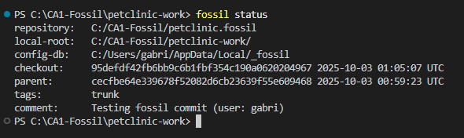
  
  - `fossil timeline`: View the commit history.
  
  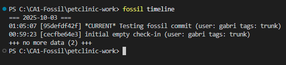
  
  - `fossil branch`: List, create, or manage branches.
  
  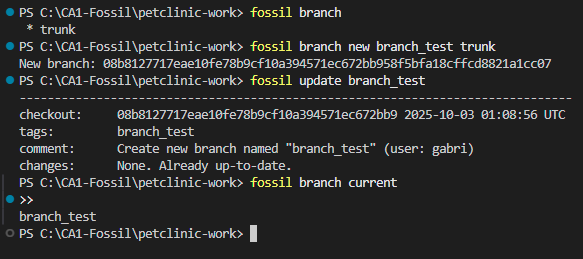

## Exercise

### 1. Check current commit using

  ```
  fossil timeline -n 1
  ```

This will return the commit hash and the commit message.

### 2. Create a tag with v1.1.0

  ```
  fossil tag add v1.1.0 current
  ```

This will create a tag named v1.1.0 at the current commit.

### 3. Add a value to Vet

  ```
  private String professionalLicenseNumber;
  ```

Exercise requires to add a new attribute to Vet class.

### 4. Added value to database

  ```
  INSERT INTO vets VALUES (default, 'Rafael', 'Ortega','57484542342342');
  
  CREATE TABLE vets (
    id         INTEGER GENERATED BY DEFAULT AS IDENTITY PRIMARY KEY,
    first_name VARCHAR(30),
    last_name  VARCHAR(30),
    professionalLicenseNumber VARCHAR(30)
  );
  ```

Exercise requires to add a new column to vets table and insert a new vet with the new attribute.

### 5. Added the commits

  - Implemented 'professionalLicenseNumber' in Vet class
      - `fossil add .`
      - `fossil commit -m "implemented 'professionalLicenseNumber' in Vet class"`
  
  - Implemented 'Database changed' in Vet class
      - `fossil add .`
      - `fossil commit -m "implemented 'Database changed' in Vet class"`
  
  - Added license number column to vets table (Vet frontend)
      - `fossil add .`
      - `fossil commit -m "add license number column to vets table"`

### 6. Identify the commit

  ```
  fossil timeline -n 20
  ```

  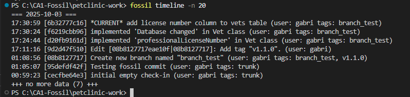

### 7. Revert the commit

In order to implement revert functionality, a helper commit was added to the repository.
  
  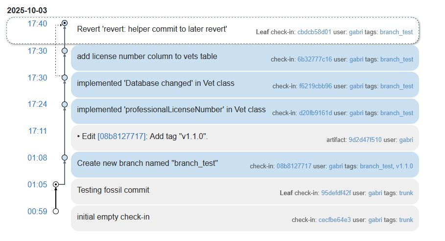
  
In this specific case, `fossil undo` was used to undo the last operation:

  ```
  fossil undo
  ```

Alternatively, to revert to a specific version:
  
  ```
  fossil update [previous-commit-hash]
  ```

### 8. Show default branch and the last commit

To identify the repository's default branch, the following command was used:

  ```
  fossil branch current
  ```

Output: `trunk` (Fossil's default branch name)
  
  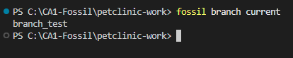
  
To see the latest commit:
  
  ```
  fossil timeline -n 1
  ```

### 9. Show distinct contributors

To show the contributions done by each person, the following command was run:

  ```
  fossil user list
  ```


For more detailed contribution statistics, you can view the timeline in the web interface:

  ```
  fossil ui
  ```

Navigate to Timeline to see all contributions by user.

### 10. At the end of the assignment mark your commit with the tag ca1-part1

  ```
  fossil tag add ca1-part1 current
  ```

  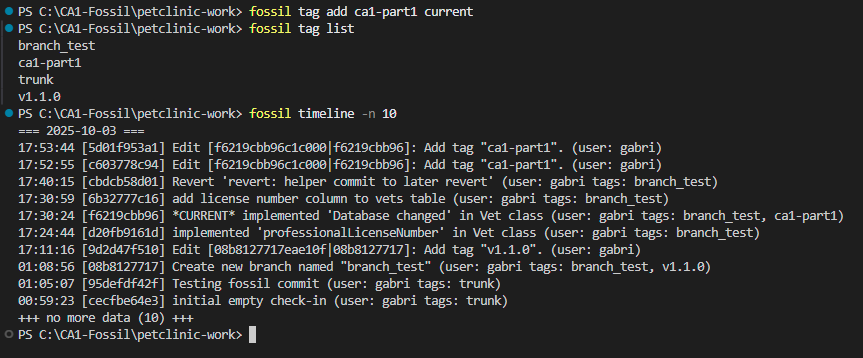

### Part 1 Commits

Through the Fossil UI, you can view the commits of the project:

  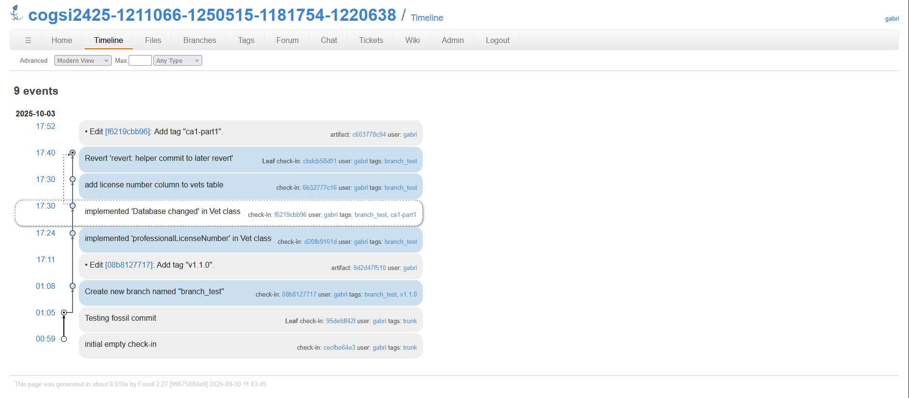

## Part 2 - Branches

### 11. To Add an email field for a vet, first, create a branch named after the feature:

```cmd
fossil branch new email-field trunk
fossil update email-field
```

Verify you're on the correct branch:

```cmd
C:\CA1-Fossil\petclinic-work> fossil branch current
email-field
```

### 12. Create the email field and database

Add to Vet.java:

```java
private String email;
```

Update schema.sql and data.sql accordingly.

### 13. Commit to the email-field branch

```cmd
C:\CA1-Fossil\petclinic-work> fossil status
repository:   C:\CA1-Fossil\petclinic.fossil
local-root:   C:\CA1-Fossil\petclinic-work\
checkout:     abc123def456... 2025-10-03 02:30:00 UTC
tags:         email-field
comment:      Added email field (user: username)
changes:      None. Use "fossil changes" for more details

EDITED    src/main/java/org/springframework/samples/petclinic/model/Vet.java
EDITED    src/main/resources/db/h2/schema.sql
EDITED    src/main/resources/db/h2/data.sql

C:\CA1-Fossil\petclinic-work> fossil commit -m "Added email field"
New_Version: def789ghi012...

C:\CA1-Fossil\petclinic-work> fossil status
repository:   C:\CA1-Fossil\petclinic.fossil
local-root:   C:\CA1-Fossil\petclinic-work\
checkout:     def789ghi012... 2025-10-03 02:31:00 UTC
tags:         email-field
comment:      Added email field (user: username)
changes:      None
```

### 14. Test to see if it is ok

```cmd
C:\CA1-Fossil\petclinic-work> mvnw.cmd clean test

[INFO] Results:
[INFO] 
[INFO] Tests run: 62, Failures: 0, Errors: 0, Skipped: 0
[INFO]
```

### 15. Merge into trunk

```cmd
fossil update trunk
fossil merge email-field
fossil commit -m "Merged email-field branch into trunk"
```

Explanation of commands:

• `fossil update trunk`
  Switches to the trunk branch.

• `fossil merge email-field`
  Merges the changes from the email-field branch into trunk.

• `fossil commit -m "Merged email-field branch into trunk"`
  Commits the merge.

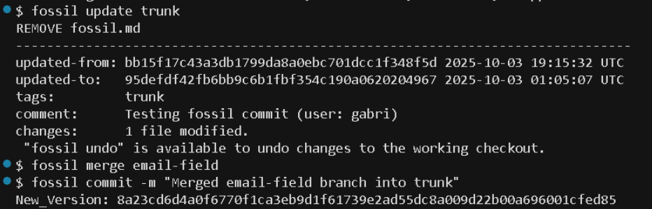

### 16. Create a tag for v1.3.0

```cmd
fossil tag add v1.3.0 current
```

Verify:

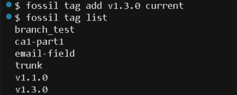

### 17. Merge conflicts

There are 2 branches in our repo, 'trunk' and 'email-field'. As trunk was already 1 commit ahead of 'email-field', edit the file with the current changes in 'trunk' and run:

```cmd
fossil update email-field
fossil merge trunk
```

This creates a merge conflict as expected:

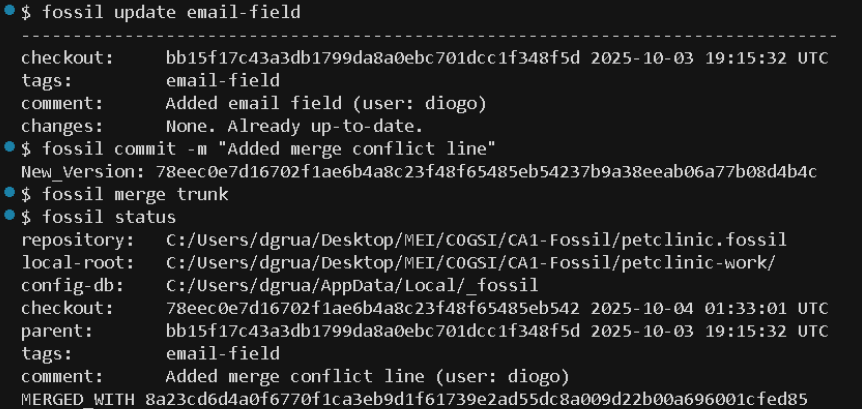

The conflict appears in the file with markers:

```
<<<<<<< BEGIN MERGE CONFLICT: local copy shown first
Added documentation of this section
||||||| COMMON ANCESTOR content follows
======= MERGED IN content follows
commit to merge conflict in main
>>>>>>> END MERGE CONFLICT
```

For testing, we just added a simple line: "MERGE CONFLICT" on fossil.md to purposely cause this merge conflict. After editing the file to resolve conflicts (removing markers and keeping desired content), we ran:

```cmd
fossil commit -m "Resolved merge conflicts"
```

### 18. Which local branch is configured to track which remote branch?

To check which local branches exist and the current branch:

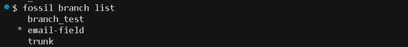

To see detailed branch information:

```cmd
fossil branch list -t
```

To check remote configuration:

```cmd
fossil remote list
```

Or view in web interface:

```cmd
fossil ui
```

Navigate to: Branches → Branch List

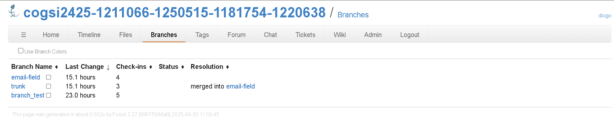

### 19. At the end of the assignment mark your commit with the tag ca1-part2

```cmd
fossil tag add ca1-part2 current
```

Verify:


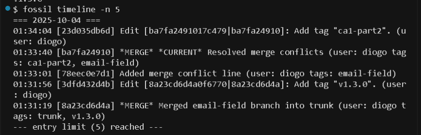

### Timeline - Part 2

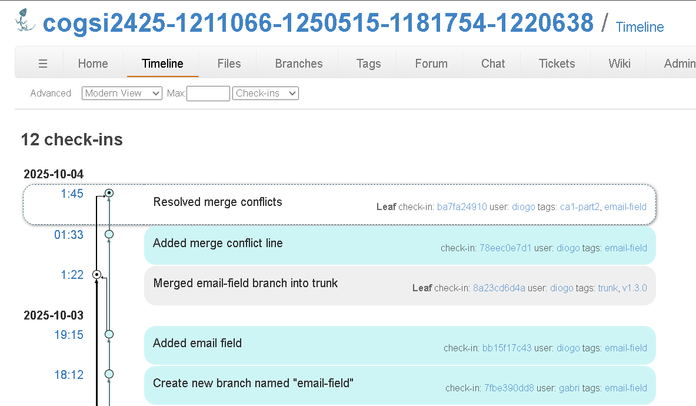

## Fossil vs Git Command Comparison

| Task | Git | Fossil |
|------|-----|--------|
| Initialize | `git init` | `fossil init repo.fossil` |
| Open repository | Automatic | `fossil open repo.fossil` |
| Add files | `git add .` | `fossil add .` |
| Commit | `git commit -m "msg"` | `fossil commit -m "msg"` |
| Push | `git push` | `fossil push` (if remote configured) |
| Pull | `git pull` | `fossil pull && fossil update` |
| Status | `git status` | `fossil status` |
| History | `git log` | `fossil timeline` |
| Create branch | `git branch name` | `fossil branch new name trunk` |
| Switch branch | `git checkout name` | `fossil update name` |
| Merge | `git merge name` | `fossil merge name` |
| Tag | `git tag v1.0` | `fossil tag add v1.0 current` |
| Diff | `git diff` | `fossil diff` |
| Revert | `git revert hash` | `fossil undo` or backout merge |
| Clone | `git clone url` | `fossil clone url repo.fossil` |

## Web Interface

To view the repository graphically:

```cmd
fossil ui
```

## Key Differences

**Fossil**
- Single file repository (easy backup)
- Built-in web UI (`fossil ui`)
- Built-in wiki and bug tracker
- No staging area (simple workflow)
- Immutable history (reliable)

**Git**
- More popular (larger community)
- More hosting options (GitHub, GitLab)
- More third-party tools
- Flexible history editing