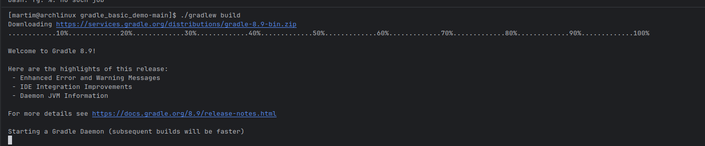
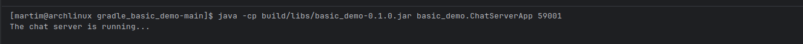
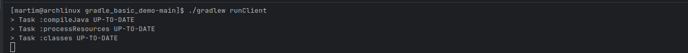
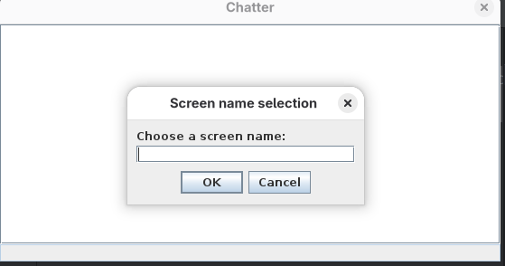
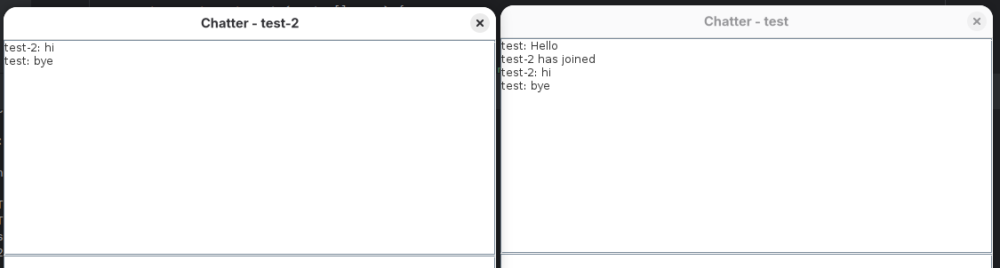
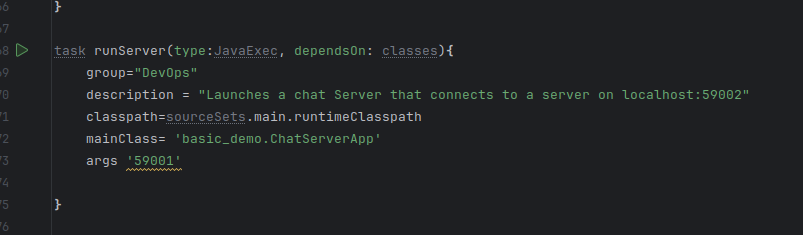
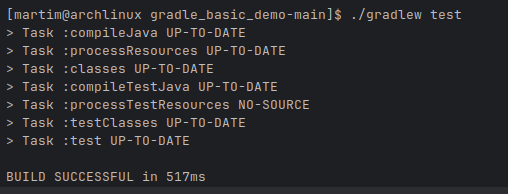
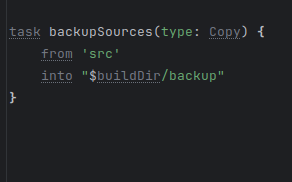
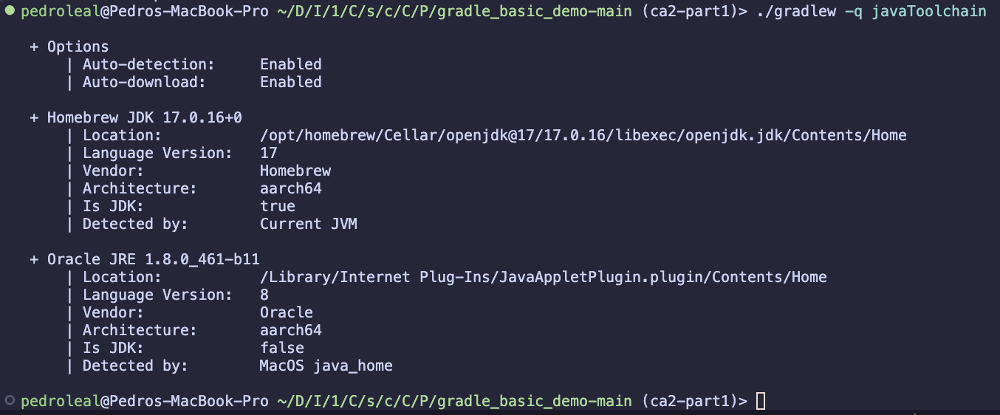

# Graddle

Gradle is a build automation tool used to compile, test, and package software projects, especially for Java, Kotlin, and other JVM-based languages.

It helps developers automate repetitive tasks like:

- Compiling source code

- Running tests

- Building executable files (like JARs)

- Managing dependencies (libraries your project needs)


## Overview Exercise


Build a multithreaded chat server in Java using Gradle.

- Server handles multiple clients, requiring unique screen names.

- Clients can send messages that are broadcast to all connected users.

- Use Gradle tasks to compile, run, and package the app:
- runClient → starts a client

Practice Gradle build automation, networking, and multithreading.


1. Read the README.md and replicate the steps

````
./gradlew build 
````



````

java -cp build/libs/basic_demo-0.1.0.jar basic_demo.ChatServerApp 59001

````




````
./gradlew runClient
````




The gradle client name




And two clients running:




2. Add a runServer task

With this we can simply add a task to run the server from gradle:
````gradle
task runServer(type:JavaExec, dependsOn: classes){
    group="DevOps"
    description = "Launches a chat Server that connects to a server on localhost:59002"
    classpath=sourceSets.main.runtimeClasspath
    mainClass= 'basic_demo.ChatServerApp'
    args '59001'

}

````

- In here we define a task of type JavaExec, which is used to run a Java application. 
- We set it to depend on the classes task, ensuring that the project is compiled before running the server.
- We set the group and description for better organization and understanding of the task.
- We set the classpath to the runtime classpath of the main source set, ensuring that all necessary classes and dependencies are available when running the server.
- We specify the main class to be executed, which is basic_demo.ChatServerApp.
- We provide the argument '59001' to specify the port on which the server will listen for incoming connections.

Then we can run the server with:

````
./gradlew runServer
````





3. Add a simple unit test and update the Gradle build script so that it can execute the test


Added a simple test to check if the server starts correctly:

````java

import org.junit.jupiter.api.Test;
import static org.junit.jupiter.api.Assertions.*;

import javax.swing.*;

public class ChatClientTest {

    @Test
    public void testClientInitialization() {
        // Run Swing code on the event dispatch thread (safe for Swing testing)
        SwingUtilities.invokeLater(() -> {
            ChatClient client = new ChatClient("localhost", 59001);

            assertNotNull(client, "ChatClient should be created");
            assertTrue(client instanceof ChatClient, "Should be instance of ChatClient");
        });
    }


}


````


Also added the test implementation dependency to the build.gradle file:

````gradle
    testImplementation 'org.junit.jupiter:junit-jupiter-api:5.10.2'
    testRuntimeOnly 'org.junit.jupiter:junit-jupiter-engine:5.10.2'

````


In the script:
````gradle

test {
    useJUnitPlatform()

    systemProperty 'java.awt.headless', 'true'

    test {
    testLogging {
        events "passed", "skipped", "failed"
    }
}
````

It will configure the test task to use the JUnit Platform for running tests, which is necessary for JUnit 5. And also to dictate if the test passes, fails or is skipped.





4. Created a baclkup task to copy the source files to a backup directory

````gradle
task backupSources(type: Copy) {
    from 'src'
    into "$buildDir/backup"
}
````

This task will copy all files from the src directory to a backup directory located at build/backup within the project structure.





5. Add a new task of type Zip to be used to make an archive of the backup of the application


    ````gradle
    task backupZip(type: Zip) {
        from "$buildDir/backup"
        archiveFileName = "application-backup-${new Date().format('yyyyMMdd-HHmmss')}.zip"
        destinationDirectory = file("${buildDir}/archives")
        
        dependsOn backupSources
        
        onlyIf {
            file("$buildDir/backup").exists() && file("$buildDir/backup").list().length > 0
        }
    }
    ````

    This Gradle task creates a timestamped ZIP file from your backup folder only if it contains files.

6. Explain how the Gradle Wrapper and the JDK Toolchain ensure
the correct versions of Gradle and the Java Development Kit
are used without requiring manual installation

     ````gradle
    ./gradlew -q javaToolchain
    ````

    This project automatically manages build tools to ensure consistent results:

    **Gradle Wrapper**

    - Uses the gradlew script to control Gradle version

    - Downloads the exact Gradle version needed for this project

    - No manual Gradle installation required

    **JDK Toolchain**

    - Automatically finds and uses the correct Java version

    - Configured in build.gradle to specify required JDK

    - Works with existing JDK installations or downloads if needed

    - Verify Setup


    **Output:**
     
7. Added a tag to the repo 

```gradle

git tag ca2-part1

git push origin ca2-part1


```