# Bazel - Part 1

Bazel is a fast, scalable build automation tool developed by Google, used to compile, test, and package software projects across multiple languages including Java, C++, Python, and more.

It helps developers automate repetitive tasks like:

- Compiling source code
- Running tests
- Building executable files (like JARs)
- Managing dependencies (libraries your project needs)
- Creating backups and archives

## Overview Exercise

Build a multithreaded chat server in Java using Bazel.

- Server handles multiple clients, requiring unique screen names.
- Clients can send messages that are broadcast to all connected users.
- Use Bazel tasks to compile, run, and package the app.

## Project Structure
```
PART_1_BAZEL/
├── .bazelversion          # Bazel version (7.4.1)
├── BUILD.bazel            # Build configuration
├── WORKSPACE              # External dependencies
├── src/
│   ├── main/java/         # Application code
│   └── test/java/         # Unit tests
└── scripts/               # Custom runner scripts
```

Practice Bazel build automation, networking, and multithreading.
---

## 1. Build the Application

Read the README.md and replicate the steps:
```powershell
bazel build //:chat_lib
```

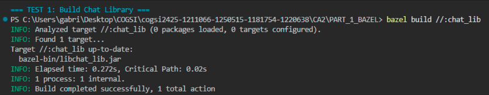

---

## 2. Run the Server

Start the chat server on port 59001:
```powershell
bazel run //:chat_server -- 59001
```

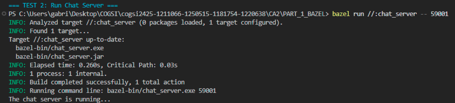

---

## 3. Run Clients

Start two chat clients, each one in their own powershell:
```powershell
bazel run //:chat_client -- localhost 59001
```

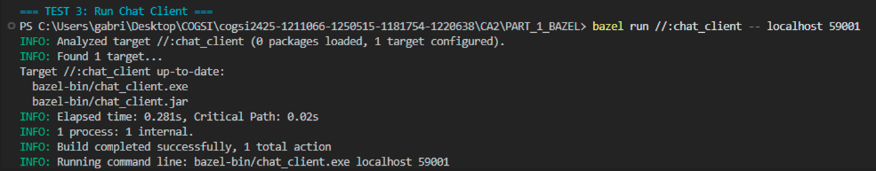

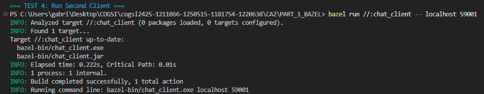

The clients can now communicate with each other through the server:

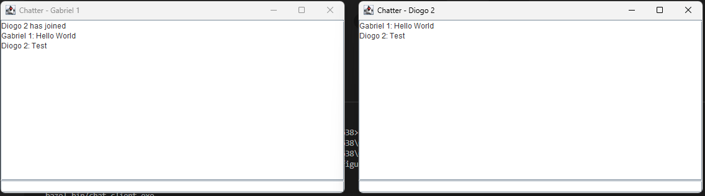

---

## 4. Add Custom Server Scripts

Added PowerShell and Batch scripts to run the server conveniently:

**PowerShell Script (`scripts/run_server.ps1`):**
```powershell
param([int]$Port = 59001)
Write-Host "Starting Chat Server on port $Port..." -ForegroundColor Green
bazel run //:chat_server -- $Port
```
**Batch Script (`scripts/run_server.bat`):**
```batch
@echo off
set PORT=%1
if "%PORT%"=="" set PORT=59001
echo Starting Chat Server on port %PORT%...
bazel run //:chat_server -- %PORT%
```

**BUILD.bazel configuration:**
```python
genrule(
    name = "run_server_ps1",
    srcs = ["scripts/run_server.ps1"],
    outs = ["run_server_wrapper.ps1"],
    cmd_bat = "copy $(location scripts/run_server.ps1) $@",
    executable = True,
    local = 1,
)
```

Run with:
```powershell
.\scripts\run_server.ps1 59001
```
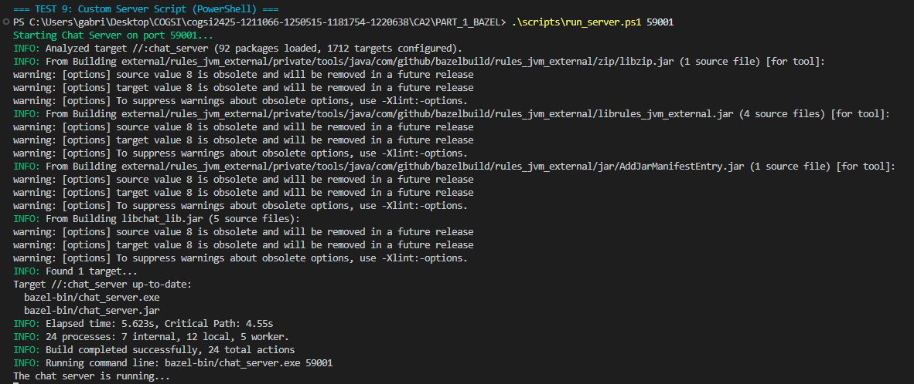

**Custom Server Script (Batch)**

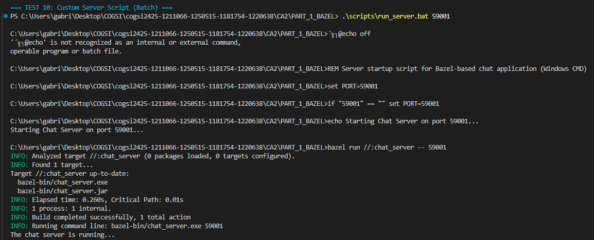

---

## 5. Add Unit Test

Added a simple test to check if the client initializes correctly:

**Test file (`src/test/java/basic_demo/ChatClientTest.java`):**
```java
import org.junit.jupiter.api.Test;
import static org.junit.jupiter.api.Assertions.*;
import javax.swing.*;

public class ChatClientTest {

    @Test
    public void testClientInitialization() {
        SwingUtilities.invokeLater(() -> {
            ChatClient client = new ChatClient("localhost", 59001);
            assertNotNull(client, "ChatClient should be created");
            assertTrue(client instanceof ChatClient, "Should be instance of ChatClient");
        });
    }
}
```

**BUILD.bazel configuration:**
```python
java_test(
    name = "chat_client_test",
    srcs = ["src/test/java/basic_demo/ChatClientTest.java"],
    test_class = "basic_demo.ChatClientTest",
    use_testrunner = False,
    main_class = "org.junit.platform.console.ConsoleLauncher",
    args = [
        "--select-class",
        "basic_demo.ChatClientTest",
        "--fail-if-no-tests",
    ],
    deps = [
        ":chat_lib",
        "@maven//:org_junit_jupiter_junit_jupiter_api",
    ],
    runtime_deps = [
        "@maven//:org_junit_jupiter_junit_jupiter_engine",
        "@maven//:org_junit_platform_junit_platform_console",
        "@maven//:org_junit_platform_junit_platform_launcher",
    ],
    jvm_flags = ["-Djava.awt.headless=true"],
)
```

**WORKSPACE configuration:**
```python
maven_install(
    artifacts = [
        "org.junit.jupiter:junit-jupiter-api:5.10.2",
        "org.junit.jupiter:junit-jupiter-engine:5.10.2",
        "org.junit.platform:junit-platform-console:1.10.2",
        "org.junit.platform:junit-platform-launcher:1.10.2",
    ],
    repositories = ["https://repo1.maven.org/maven2"],
)
```

Run tests:
```powershell
bazel test //:chat_client_test --test_output=all
```

**Run Unit Tests**

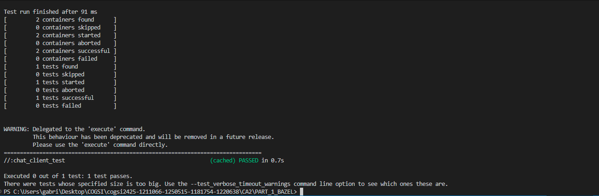

---

## 6. Create Backup Task

Created a backup task to copy the source files to a backup directory:

**BUILD.bazel:**
```python
genrule(
    name = "backup_sources",
    srcs = glob(["src/**/*"]),
    outs = ["backup_complete.txt"],
    cmd_bat = "xcopy /E /I /Y src backup\\src > nul 2>&1 & powershell -Command \"'Backup completed' | Out-File -FilePath $(OUTS) -Encoding ASCII\"",
    local = 1,
)
```

This task copies all files from the `src` directory to `backup/src/`.

Run backup:
```powershell
bazel build //:backup_sources
```

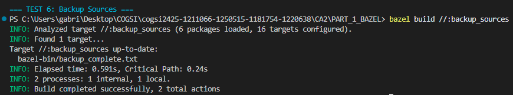

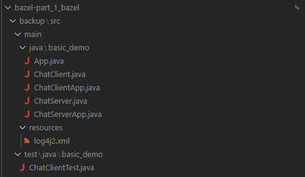

---

## 7. Add Backup ZIP Task

Created a ZIP task to archive the backup. This task depends on the backup task.

**BUILD.bazel:**
```python
genrule(
    name = "backup_zip",
    srcs = [":backup_sources"],  # Depends on backup_sources
    outs = ["application-backup.zip"],
    cmd_bat = "if exist backup ( powershell -NoProfile -Command \"Compress-Archive -Path 'backup\\*' -DestinationPath $(OUTS) -Force\" )",
    local = 1,
)
```

This task creates a ZIP file from the backup folder only if it exists. It depends on `backup_sources`, ensuring the backup runs first.

Run ZIP creation:
```powershell
bazel build //:backup_zip
```

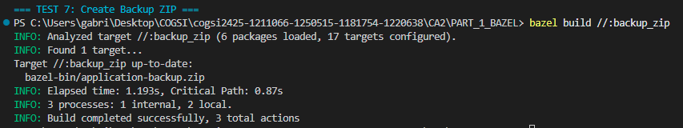

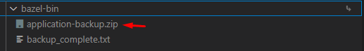

---

## 8. Bazel Version Management

### How Bazel Ensures Correct Versions Without Manual Installation

This project automatically manages build tools to ensure consistent results across all developers.

#### Bazel Version Control (`.bazelversion` file)

- Uses Bazelisk to control Bazel version
- Downloads the exact Bazel version needed for this project (7.4.1)
- No manual Bazel installation required

**Check version:**
```powershell
bazel --version
# Output: bazel 7.4.1
```

#### Java Toolchain

- Automatically finds and uses the correct Java version
- Reads from `JAVA_HOME` environment variable
- Can be configured to download specific JDK versions if needed

**Query Java toolchain:**
```powershell
bazel query --output=build @bazel_tools//tools/jdk:current_java_runtime
```

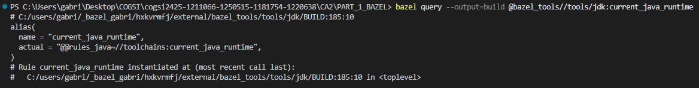

**Comparison to Gradle:**

| Feature | Gradle | Bazel |
|---------|--------|-------|
| Version file | `gradle-wrapper.properties` | `.bazelversion` |
| Wrapper tool | `gradlew` | Bazelisk |
| Auto-download | ✅ Yes | ✅ Yes |
| Java detection | `JAVA_HOME` | `JAVA_HOME` |

---

## 9. Git Tags

Added tags to the repository to mark versions:
```powershell
git tag ca2-1.1.0      # Initial version
git tag ca2-part1      # Final version

git push origin ca2-1.1.0
git push origin ca2-part1
```

---

## Quick Reference
```powershell
# Build
bazel build //:chat_lib

# Run
bazel run //:chat_server -- 59001
bazel run //:chat_client -- localhost 59001

# Custom scripts
.\scripts\run_server.ps1 59001
.\scripts\run_server.bat 59001

# Test
bazel test //:chat_client_test --test_output=all

# Backup & Archive
bazel build //:backup_sources
bazel build //:backup_zip

# Clean
bazel clean
bazel clean --expunge
```
