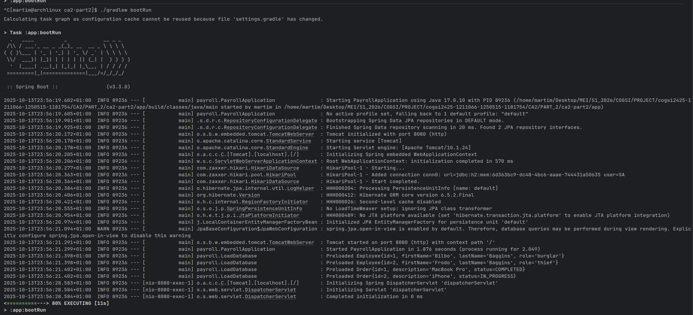
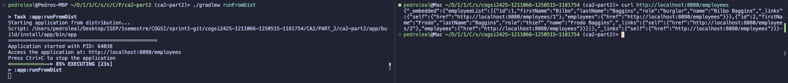

1. This part will be done the analysis of aa Spring-boot project, that uses Maven as build tool, and convert it to a Gradle project.

````
git clone https://github.com/spring-guides/tut-rest.git
````

- Run the project with maven:

````

cd tut-rest-main
./mvnw spring-boot:run
````

2. Create a new directory called ca2-part2 and copy the files from tut-rest-main into it, except the .mvn directory and the mvnw and mvnw.cmd files.

````
mkdir ca2-part2
gradle init --type java-application
````
3. Copied the source files from tut-rest-main/links/src/ to ca2-part2/app/src/

```` 
rm -rf app/src
cp -r ../tut-rest-main/links/src app/src
````
3. Create a build.gradle file in the ca2-part2 directory with the following content:

````gradle
plugins {
    id 'org.springframework.boot' version '3.3.0'
    id 'io.spring.dependency-management' version '1.1.5'
    id 'java'
}

group = 'com.example'
version = '0.0.1-SNAPSHOT'

java {
    toolchain {
        languageVersion = JavaLanguageVersion.of(17)
    }
}

repositories {
    mavenCentral()
}

dependencies {
    // Spring Web (REST API)
    implementation 'org.springframework.boot:spring-boot-starter-web'

    // Spring Data JPA for repository support
    implementation 'org.springframework.boot:spring-boot-starter-data-jpa'

    // H2 in-memory database
    runtimeOnly 'com.h2database:h2'

    // Spring HATEOAS for hypermedia links
    implementation 'org.springframework.boot:spring-boot-starter-hateoas'

    // Spring Boot Test
    testImplementation 'org.springframework.boot:spring-boot-starter-test'
}

test {
    useJUnitPlatform()
}
````
 - The build script applies the necessary plugins for Spring Boot and Java, sets the Java toolchain to version 17, and includes dependencies for Spring Web, Spring Data JPA, H2 database, Spring HATEOAS, and Spring Boot Test.
 - The repositories block specifies Maven Central as the source for dependencies.
 - The test block configures the test task to use JUnit Platform.
 - The group and version properties define the project's group ID and version.

4. To build the project, open a terminal in the ca2-part2 directory and run:

````
./gradlew build
````


## Create a custom task named **deployToDev**

The deployToDev task successfully automates the deployment process by executing four sequential steps:

### Step 1: Clean Deployment Directory

- Action: Deletes the existing build/deployment/dev directory

- Purpose: Ensures a clean deployment environment

- Gradle Task Type: Built-in Delete functionality

### Step 2: Copy Main Application Artifact

- Action: Copies the built JAR file to deployment directory

- Result: application.jar created in deployment folder

- Note: File is renamed from app-0.0.1-SNAPSHOT.jar to application.jar for standardization

### Step 3: Copy Runtime Dependencies

- Action: Copies all runtime dependencies to lib/ subdirectory

- Result: 58 dependency JARs copied (Spring Boot, Hibernate, H2 database, etc.)

- Configuration: Uses configurations.runtimeClasspath to get correct dependencies

- Exclusion: Filters out the main application JAR to avoid duplication

### Step 4: Copy Configuration Files

- Result: "No properties files found to copy" - This is expected since the application uses Spring Boot's auto-configuration and doesn't have custom .properties files


### Output

    ```pedroleal@Pedros-MBP ~/D/I/1/C/s/c/C/P/ca2-part2 (ca2-part2)> ./gradlew deployToDev

    > Task :app:deployToDev
    Starting deployment to: /Users/pedroleal/Desktop/ISEP/1semestre/COGSI/sprint1-git/cogsi2425-1211066-1250515-1181754/CA2/PART_2/ca2-part2/app/build/deployment/dev
    Copied application JAR
    Copied runtime dependencies
    No properties files found to copy
    Deployment completed successfully to: /Users/pedroleal/Desktop/ISEP/1semestre/COGSI/sprint1-git/cogsi2425-1211066-1250515-1181754/CA2/PART_2/ca2-part2/app/build/deployment/dev

    Deployment Summary:
        /application.jar
        /lib/spring-tx-6.1.8.jar
        /lib/spring-jdbc-6.1.8.jar
        /lib/spring-plugin-core-3.0.0.jar
        /lib/spring-aspects-6.1.8.jar
        /lib/spring-boot-starter-jdbc-3.3.0.jar
        /lib/jakarta.persistence-api-3.1.0.jar
        /lib/txw2-4.0.5.jar
        /lib/logback-classic-1.5.6.jar
        /lib/snakeyaml-2.2.jar
        /lib/jul-to-slf4j-2.0.13.jar
        /lib/spring-boot-starter-3.3.0.jar
        /lib/jakarta.inject-api-2.0.1.jar
        /lib/spring-boot-starter-tomcat-3.3.0.jar
        /lib/tomcat-embed-el-10.1.24.jar
        /lib/spring-boot-starter-web-3.3.0.jar
        /lib/jackson-core-2.17.1.jar
        /lib/spring-boot-starter-hateoas-3.3.0.jar
        /lib/h2-2.2.224.jar
        /lib/asm-9.6.jar
        /lib/spring-boot-starter-aop-3.3.0.jar
        /lib/spring-data-commons-3.3.0.jar
        /lib/spring-webmvc-6.1.8.jar
        /lib/micrometer-observation-1.13.0.jar
        /lib/spring-aop-6.1.8.jar
        /lib/byte-buddy-1.14.16.jar
        /lib/spring-hateoas-2.3.0.jar
        /lib/jandex-3.1.2.jar
        /lib/classmate-1.7.0.jar
        /lib/hibernate-core-6.5.2.Final.jar
        /lib/jakarta.transaction-api-2.0.1.jar
        /lib/spring-web-6.1.8.jar
        /lib/spring-boot-starter-logging-3.3.0.jar
        /lib/spring-boot-starter-json-3.3.0.jar
        /lib/jackson-databind-2.17.1.jar
        /lib/jackson-annotations-2.17.1.jar
        /lib/jakarta.activation-api-2.1.3.jar
        /lib/spring-boot-starter-data-jpa-3.3.0.jar
        /lib/spring-context-6.1.8.jar
        /lib/spring-orm-6.1.8.jar
        /lib/slf4j-api-2.0.13.jar
        /lib/micrometer-commons-1.13.0.jar
        /lib/tomcat-embed-websocket-10.1.24.jar
        /lib/HikariCP-5.1.0.jar
        /lib/spring-core-6.1.8.jar
        /lib/json-smart-2.5.1.jar
        /lib/jboss-logging-3.5.3.Final.jar
        /lib/spring-jcl-6.1.8.jar
        /lib/json-path-2.9.0.jar
        /lib/log4j-api-2.23.1.jar
        /lib/jackson-datatype-jsr310-2.17.1.jar
        /lib/log4j-to-slf4j-2.23.1.jar
        /lib/jaxb-runtime-4.0.5.jar
        /lib/jakarta.annotation-api-2.1.1.jar
        /lib/accessors-smart-2.5.1.jar
        /lib/spring-beans-6.1.8.jar
        /lib/aspectjweaver-1.9.22.jar
        /lib/jackson-datatype-jdk8-2.17.1.jar
        /lib/tomcat-embed-core-10.1.24.jar
        /lib/istack-commons-runtime-4.1.2.jar
        /lib/jakarta.xml.bind-api-4.0.2.jar
        /lib/antlr4-runtime-4.13.0.jar
        /lib/hibernate-commons-annotations-6.0.6.Final.jar
        /lib/jaxb-core-4.0.5.jar
        /lib/jackson-module-parameter-names-2.17.1.jar
        /lib/spring-boot-3.3.0.jar
        /lib/spring-expression-6.1.8.jar
        /lib/logback-core-1.5.6.jar
        /lib/spring-boot-autoconfigure-3.3.0.jar
        /lib/spring-data-jpa-3.3.0.jar
        /lib/angus-activation-2.0.2.jar

    [Incubating] Problems report is available at: file:///Users/pedroleal/Desktop/ISEP/1semestre/COGSI/sprint1-git/cogsi2425-1211066-1250515-1181754/CA2/PART_2/ca2-part2/build/reports/problems/problems-report.html

    Deprecated Gradle features were used in this build, making it incompatible with Gradle 10.

    You can use '--warning-mode all' to show the individual deprecation warnings and determine if they come from your own scripts or plugins.

    For more on this, please refer to https://docs.gradle.org/9.1.0/userguide/command_line_interface.html#sec:command_line_warnings in the Gradle documentation.

    BUILD SUCCESSFUL in 461ms
    3 actionable tasks: 1 executed, 2 up-to-date
    pedroleal@Pedros-MBP ~/D/I/1/C/s/c/C/P/ca2-part2 (ca2-part2)> ```


## Create a custom task that depends on the installDist task, running the application using the generated distribution scripts

The task successfully starts the Spring Boot application using the generated distribution scripts, demonstrating a production-like deployment approach. 

On the left terminal the **runFromDist** task is run and then to verify its actually running properly, I request to the API via curl is done.


*Left: Task execution showing successful startup with PID 63680*  
*Right: API verification returning employee data*