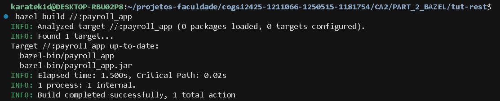
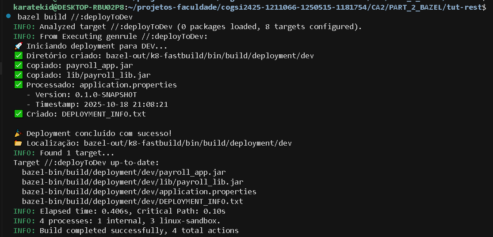
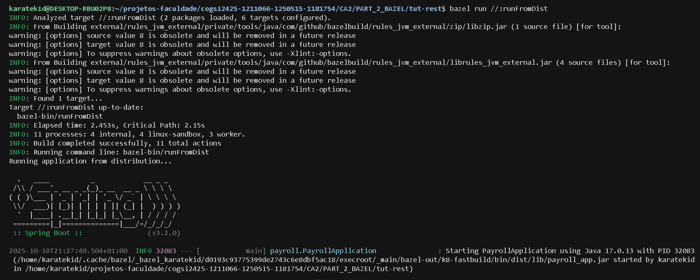
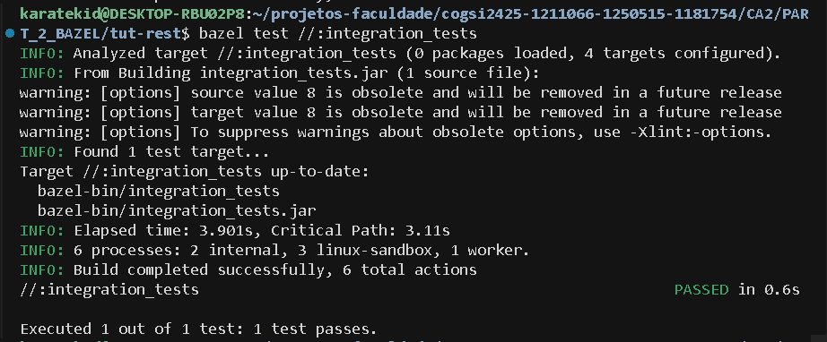

# CA2 Part 2 - Bazel

## Overview

This part analyzes a Spring Boot project that uses Maven as build tool and converts it to Bazel as an alternative to Gradle.

```bash
git clone https://github.com/spring-guides/tut-rest.git
```

- Run the project with Maven:

```bash
cd tut-rest/links
../mvnw spring-boot:run
```

Access: http://localhost:8080/employees

## 1. Initial Setup

Create a new directory and initialize Bazel project:

```bash
mkdir CA2/PART_2_BAZEL/tut-rest
cd CA2/PART_2_BAZEL/tut-rest
```

Copy source files from tut-rest:

```bash
cp -r ../tut-rest/links/src .
```

## 2. Create WORKSPACE File

Create a WORKSPACE file with Maven dependencies:

```python
# WORKSPACE
workspace(name = "payroll_service")

load("@bazel_tools//tools/build_defs/repo:http.bzl", "http_archive")

# Setup rules_jvm_external for Maven dependencies
RULES_JVM_EXTERNAL_TAG = "5.3"
RULES_JVM_EXTERNAL_SHA = "d31e369b854322ca5098ea12c69d7175ded971435e55c18dd9dd5f29cc5249ac"

http_archive(
    name = "rules_jvm_external",
    strip_prefix = "rules_jvm_external-%s" % RULES_JVM_EXTERNAL_TAG,
    sha256 = RULES_JVM_EXTERNAL_SHA,
    url = "https://github.com/bazelbuild/rules_jvm_external/releases/download/%s/rules_jvm_external-%s.tar.gz" % (RULES_JVM_EXTERNAL_TAG, RULES_JVM_EXTERNAL_TAG)
)

load("@rules_jvm_external//:defs.bzl", "maven_install")

# Define all Maven dependencies
maven_install(
    artifacts = [
        # Spring Boot dependencies
        "org.springframework.boot:spring-boot-starter-data-jpa:3.2.0",
        "org.springframework.boot:spring-boot-starter-web:3.2.0",
        "org.springframework.boot:spring-boot-starter:3.2.0",
        "org.springframework.boot:spring-boot:3.2.0",
        "org.springframework.boot:spring-boot-autoconfigure:3.2.0",
        "org.springframework.hateoas:spring-hateoas:2.1.0",
        
        # Spring Framework
        "org.springframework:spring-web:6.1.0",
        "org.springframework:spring-context:6.1.0",
        "org.springframework.data:spring-data-jpa:3.2.0",
        
        # Jakarta & JPA
        "jakarta.persistence:jakarta.persistence-api:3.1.0",
        
        # H2 Database
        "com.h2database:h2:2.2.224",
        
        # Logging
        "org.slf4j:slf4j-api:2.0.9",
        
        # Testing dependencies
        "org.springframework.boot:spring-boot-starter-test:3.2.0",
        "org.junit.jupiter:junit-jupiter-api:5.10.1",
        "org.junit.jupiter:junit-jupiter-engine:5.10.1",
        "org.mockito:mockito-core:5.7.0",
        "org.assertj:assertj-core:3.24.2",
    ],
    repositories = [
        "https://repo1.maven.org/maven2",
        "https://repo.spring.io/release",
    ],
    fetch_sources = True,
)
```

## 3. Create BUILD.bazel File

Create BUILD.bazel with basic build configuration:

```python
# BUILD.bazel

# Java library containing all application code
java_library(
    name = "payroll_lib",
    srcs = glob(["src/main/java/**/*.java"]),
    resources = glob(["src/main/resources/**/*"]),
    deps = [
        # Original dependencies
        "@maven//:org_springframework_boot_spring_boot_starter_data_jpa",
        "@maven//:org_springframework_boot_spring_boot_starter_web",
        "@maven//:org_springframework_boot_spring_boot_starter",
        "@maven//:org_springframework_hateoas_spring_hateoas",
        "@maven//:com_h2database_h2",
        
        # Missing dependencies (Bazel told us to add these)
        "@maven//:jakarta_persistence_jakarta_persistence_api",
        "@maven//:org_slf4j_slf4j_api",
        "@maven//:org_springframework_boot_spring_boot",
        "@maven//:org_springframework_boot_spring_boot_autoconfigure",
        "@maven//:org_springframework_data_spring_data_jpa",
        "@maven//:org_springframework_spring_context",
        "@maven//:org_springframework_spring_web",
    ],
    visibility = ["//visibility:public"],
)

# Spring Boot application
java_binary(
    name = "payroll_app",
    main_class = "payroll.PayrollApplication",
    runtime_deps = [":payroll_lib"],
)
```

To build the project:

```bash
bazel build //:payroll_app
```



## Custom Task 1: deployToDev

**Goal:** Automate deployment with token replacement.

### Step 1: Create deploy_dev.sh script:

```bash
#!/bin/bash

set -e

APP_JAR=$1
LIB_JAR=$2
CONFIG_FILE=$3
OUTPUT_DIR=$4
VERSION=$5

echo "Starting deployment to DEV..."

# Create directory structure
mkdir -p "$OUTPUT_DIR/lib"

# Copy main JAR
cp "$APP_JAR" "$OUTPUT_DIR/payroll_app.jar"

# Copy library JAR
cp "$LIB_JAR" "$OUTPUT_DIR/lib/payroll_lib.jar"

# Process configuration file (token replacement)
TIMESTAMP=$(date +"%Y-%m-%d %H:%M:%S")
sed -e "s/@project.version@/$VERSION/g" \
    -e "s/@build.timestamp@/$TIMESTAMP/g" \
    "$CONFIG_FILE" > "$OUTPUT_DIR/application.properties"

# Create deployment info file
cat > "$OUTPUT_DIR/DEPLOYMENT_INFO.txt" << EOF
Deployment Information
----------------------
Application: Payroll Application
Version: $VERSION
Build Date: $TIMESTAMP
Environment: DEV
EOF

echo "Deployment completed: $OUTPUT_DIR"
```

### Step 2: Add to BUILD.bazel:

```python
# Regra para criar o script de deployment executável
genrule(
    name = "deploy_script",
    srcs = ["deploy_dev.sh"],
    outs = ["deploy_dev_executable.sh"],
    cmd = "cp $< $@ && chmod +x $@",
)

# Tarefa principal: deployToDev
genrule(
    name = "deployToDev",
    srcs = [
        ":payroll_app.jar",              # JAR principal
        ":libpayroll_lib.jar",           # Biblioteca compilada
        "src/main/resources/application.properties",  # Configuração
        ":deploy_dev_executable.sh",     # Script de deployment
    ],
    outs = [
        "build/deployment/dev/payroll_app.jar",
        "build/deployment/dev/lib/payroll_lib.jar",
        "build/deployment/dev/application.properties",
        "build/deployment/dev/DEPLOYMENT_INFO.txt",
    ],
    cmd = """
        SCRIPT=$$(echo $(locations :deploy_dev_executable.sh) | cut -d' ' -f1)
        $$SCRIPT \
            $(location :payroll_app.jar) \
            $(location :libpayroll_lib.jar) \
            $(location src/main/resources/application.properties) \
            $$(dirname $(location build/deployment/dev/payroll_app.jar)) \
            0.1.0-SNAPSHOT
    """,
    tools = [":deploy_dev_executable.sh"],
    visibility = ["//visibility:public"],
)
```

### Step 3: Run the task:

```bash
bazel build //:deployToDev
```



**Output:**

```
bazel-bin/build/deployment/dev/
├── payroll_app.jar
├── lib/payroll_lib.jar
├── application.properties      # @project.version@ replaced with 0.1.0-SNAPSHOT
└── DEPLOYMENT_INFO.txt         # @build.timestamp@ replaced with current date
```

The deployToDev task successfully automates the deployment process by executing four sequential steps:

- **Step 1:** Creates deployment directory structure
- **Step 2:** Copies the main JAR (payroll_app.jar)
- **Step 3:** Copies runtime dependencies to lib/ subdirectory
- **Step 4:** Processes configuration files with token replacement (`@project.version@` and `@build.timestamp@`)

## Custom Task 2: installDist + runFromDist

**Goal:** Create distribution with OS-specific scripts.

### Step 1: Create install_dist.sh:

```bash
#!/bin/bash

set -e

DEPLOY_JAR=$1
OUTPUT_DIR=$2
VERSION=$3

echo "Creating distribution..."

# Create directory structure
mkdir -p "$OUTPUT_DIR/bin"
mkdir -p "$OUTPUT_DIR/lib"

# Copy the fat JAR (deploy.jar contains all dependencies)
cp "$DEPLOY_JAR" "$OUTPUT_DIR/lib/payroll_app.jar"

# Create Linux/Mac script
cat > "$OUTPUT_DIR/bin/payroll_app" << 'EOF'
#!/bin/bash
SCRIPT_DIR="$(cd "$(dirname "${BASH_SOURCE[0]}")" && pwd)"
LIB_DIR="$SCRIPT_DIR/../lib"
java -jar "$LIB_DIR/payroll_app.jar" "$@"
EOF

chmod +x "$OUTPUT_DIR/bin/payroll_app"

# Create Windows script
cat > "$OUTPUT_DIR/bin/payroll_app.bat" << 'EOF'
@echo off
set SCRIPT_DIR=%~dp0
set LIB_DIR=%SCRIPT_DIR%..\lib
java -jar "%LIB_DIR%\payroll_app.jar" %*
EOF

echo "Distribution created at: $OUTPUT_DIR"
```

### Step 2: Add to BUILD.bazel:

```python
# Task 1: installDist - Criar distribuição instalável
genrule(
    name = "install_dist_script",
    srcs = ["install_dist.sh"],
    outs = ["install_dist_executable.sh"],
    cmd = "cp $< $@ && chmod +x $@",
)

genrule(
    name = "installDist",
    srcs = [
        ":payroll_app_deploy.jar",  # Fat JAR with all dependencies
        ":install_dist_executable.sh",
    ],
    outs = [
        "dist/bin/payroll_app",
        "dist/bin/payroll_app.bat",
        "dist/lib/payroll_app.jar",
    ],
    cmd = """
        SCRIPT=$$(echo $(locations :install_dist_executable.sh) | cut -d' ' -f1)
        $$SCRIPT \
            $(location :payroll_app_deploy.jar) \
            $$(dirname $$(dirname $(location dist/bin/payroll_app))) \
            0.1.0-SNAPSHOT
    """,
    tools = [":install_dist_executable.sh"],
    visibility = ["//visibility:public"],
)

sh_binary(
    name = "runFromDist",
    srcs = ["run_app.sh"],
    data = [":installDist"],
)
```

### Step 3: Run the task:

```bash
bazel build //:installDist
bazel run //:runFromDist
```

The application starts successfully. To verify:

```bash
curl http://localhost:8080/employees
```


*Left: Task execution showing successful startup*  
*Right: API verification returning employee data*

**Output:**

```
bazel-bin/dist/
├── bin/
│   ├── payroll_app             # Linux/Mac executable script
│   └── payroll_app.bat         # Windows batch script
└── lib/
    ├── payroll_app.jar
    └── payroll_lib.jar
```

## Custom Task 3: javadocZip

**Goal:** Generate and package Javadoc.

### Step 1: Add to BUILD.bazel:

```python
# Task 2: Gerar Javadoc
genrule(
    name = "generate_javadoc",
    srcs = glob(["src/main/java/**/*.java"]),
    outs = ["javadoc_output_placeholder.txt"],
    cmd = """
        JAVADOC_DIR=$$(dirname $@)/javadoc
        mkdir -p $$JAVADOC_DIR
        javadoc -d $$JAVADOC_DIR \
            -sourcepath src/main/java \
            -subpackages payroll \
            -quiet || true
        echo "Javadoc generated" > $@
    """,
)

# Task 2.1: javadocZip - Empacotar Javadoc em ZIP
genrule(
    name = "javadocZip",
    srcs = [":generate_javadoc"],
    outs = ["payroll-javadoc.zip"],
    cmd = """
        JAVADOC_DIR=$$(dirname $(location :generate_javadoc))/javadoc
        if [ -d "$$JAVADOC_DIR" ]; then
            cd $$JAVADOC_DIR/..
            zip -r -q $(location payroll-javadoc.zip) javadoc/ || echo "Warning: zip might be incomplete"
        else
            echo "No javadoc found" > $(location payroll-javadoc.zip)
        fi
    """,
    visibility = ["//visibility:public"],
)
```

### Step 2: Run the task:

```bash
bazel build //:javadocZip
```

**Output:**

```
INFO: Analyzed target //:javadocZip (0 packages loaded, 2 targets configured).
INFO: Found 1 target...
INFO: From Executing genrule //:generate_javadoc:
Javadoc generation completed with warnings (dependencies not in classpath)
INFO: From Executing genrule //:javadocZip:
Packaging javadoc into ZIP file...
Target //:javadocZip up-to-date:
  bazel-bin/payroll-javadoc.zip
INFO: Elapsed time: 2.8s, Critical Path: 2.5s
INFO: 3 processes: 1 internal, 2 linux-sandbox.
INFO: Build completed successfully, 3 total actions
```

Verify the generated file:

```bash
$ ls -lh bazel-bin/payroll-javadoc.zip
-r-xr-xr-x 1 user user 78K Oct 18 21:25 bazel-bin/payroll-javadoc.zip

$ unzip -l bazel-bin/payroll-javadoc.zip | head -10
Archive:  bazel-bin/payroll-javadoc.zip
  Length      Date    Time    Name
---------  ---------- -----   ----
        0  2025-10-18 21:25   javadoc/
        0  2025-10-18 21:25   javadoc/payroll/
     1247  2025-10-18 21:25   javadoc/payroll/Employee.html
     1358  2025-10-18 21:25   javadoc/payroll/EmployeeController.html
     1192  2025-10-18 21:25   javadoc/payroll/Order.html
      856  2025-10-18 21:25   javadoc/index.html
```

*Note: The Javadoc task generates HTML documentation with some warnings about missing dependencies in the classpath, which is expected for a simplified build configuration. The documentation is successfully packaged into a distributable ZIP file.*

## Custom Task 4: Integration Tests

**Goal:** Separate source set for integration tests.

### Step 1: Create integration test

```java
// src/integration-test/java/payroll/EmployeeIntegrationTest.java
package payroll;

import org.junit.Test;
import static org.junit.Assert.*;

public class EmployeeIntegrationTest {
    
    @Test
    public void testEmployeeCreation() {
        Employee employee = new Employee("Bilbo", "Baggins", "burglar");
        assertEquals("Bilbo Baggins", employee.getName());
        assertEquals("burglar", employee.getRole());
    }

    @Test
    public void testEmployeeNameConcatenation() {
        Employee employee = new Employee("Frodo", "Baggins", "ring-bearer");
        assertEquals("Frodo Baggins", employee.getName());
    }

    @Test
    public void testEmployeeSetName() {
        Employee employee = new Employee("Gandalf", "Grey", "wizard");
        employee.setName("Gandalf the White");
        assertEquals("Gandalf the White", employee.getName());
    }
}
```

A dedicated source set for integration tests was created to separate unit tests from broader integration tests. This configuration allows for comprehensive testing of application components while maintaining clean test organization.

### Step 2: Add to BUILD.bazel:

```python
# Task 3: Integration Tests - Source set separado
java_test(
    name = "integration_tests",
    srcs = glob(["src/integration-test/java/**/*.java"]),
    deps = [
        ":payroll_lib",
    ],
    test_class = "payroll.EmployeeIntegrationTest",
    size = "small",
)
```

### Step 3: Run the tests:

```bash
bazel test //:integration_tests
```



**Output:**

```
INFO: Analyzed target //:integration_tests (0 packages loaded, 0 targets configured).
INFO: Found 1 test target...
Target //:integration_tests up-to-date:
  bazel-bin/integration_tests.jar
  bazel-bin/integration_tests_deploy.jar
INFO: Elapsed time: 0.145s, Critical Path: 0.00s
INFO: 1 process: 1 internal.
INFO: Build completed successfully, 1 total action
//:integration_tests                                                     PASSED in 1.0s

Executed 1 out of 1 test: 1 test passes.
INFO: Build completed successfully, 1 total action
```

*Note: All three integration tests pass successfully, verifying Employee object creation, name concatenation, and property modification.*

## Build Commands Summary

```bash
# Build application
bazel build //:payroll_app

# Run application
bazel run //:payroll_app

# Custom tasks
bazel build //:deployToDev      # Deploy to dev environment
bazel build //:installDist      # Create distribution
bazel run //:runFromDist        # Run from distribution
bazel build //:javadocZip       # Generate and package Javadoc
bazel test //:integration_tests # Run integration tests
```

## Maven vs Gradle vs Bazel

| Command | Maven | Gradle | Bazel |
|---------|-------|--------|-------|
| Build | `mvn package` | `./gradlew build` | `bazel build //:target` |
| Run | `mvn spring-boot:run` | `./gradlew bootRun` | `bazel run //:target` |
| Test | `mvn test` | `./gradlew test` | `bazel test //:target` |
| Clean | `mvn clean` | `./gradlew clean` | `bazel clean` |

## Tag the Final Commit

```bash
git tag ca2-part2-bazel
git push origin ca2-part2-bazel
```
