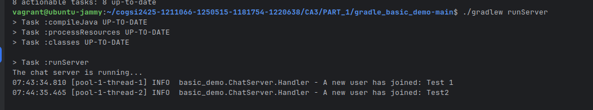

# Vagrant

Vagrant is a tool for building and managing virtual machine environments in a single workflow. It provides a simple and easy-to-use command-line interface to create and configure lightweight, reproducible, and portable development environments.

## Prerequisites
- Install [Vagrant](https://www.vagrantup.com/downloads)
- Install a virtualization provider like [VirtualBox](https://www.virtualbox.org/wiki/Downloads)
- (Optional) Install [Vagrant plugins](https://www.vagrantup.com/docs/plugins) if needed for your specific use case.

## Getting Started

1. **Create a Vagrantfile**: This file defines the configuration of your virtual machine. You can create a new directory for your project and run `vagrant init` to generate a basic Vagrantfile.

   ```bash
   mkdir PART_1/Vagrant
   cd my_vagrant_project
   vagrant init
   ```
2. **Configure the Vagrantfile**: Edit the Vagrantfile to specify the base box, network settings, and any provisioning scripts you want to run.
    ```ruby
    Vagrant.configure("2") do |config|
    config.vm.box = "ubuntu/jammy64"
    config.vm.synced_folder ".", "/vagrant"
    config.vm.provision "shell", path: "provision.sh"
    end
    ```
In this example, we are using the Ubuntu Jammy 64-bit box and syncing the current directory to `/vagrant` in the VM. We also specify a shell script for provisioning.
3. **Create a Dependency Script**: Create a script (e.g., `scripts/install-dependecies.sh`) to install any dependencies your project needs.

   ```
    #!/usr/bin/env bash
    set -e
    echo "==== Updating system packages ===="

    sudo apt-get update -y
    sudo apt-get install -y curl zip unzip git wget tar


    echo "==== Installing Java 17 ===="
    sudo apt-get install -y openjdk-17-jdk
    java -version


    echo "==== Installing Maven 3.9.3 ===="
    MAVEN_VERSION=3.9.3
    wget -q https://archive.apache.org/dist/maven/maven-3/$MAVEN_VERSION/binaries/apache-maven-$MAVEN_VERSION-bin.tar.gz -P /tmp
    sudo tar xf /tmp/apache-maven-$MAVEN_VERSION-bin.tar.gz -C /opt
    sudo ln -sf /opt/apache-maven-$MAVEN_VERSION /opt/maven
    #Add Maven to PATH
    echo 'export PATH=$PATH:/opt/maven/bin' | sudo tee /etc/profile.d/maven.sh
    sudo chmod +x /etc/profile.d/maven.sh
    source /etc/profile.d/maven.sh
    mvn -v

    echo "==== Installing Gradle 9.1.0 ===="
    GRADLE_VERSION=9.1.0
    wget -q https://services.gradle.org/distributions/gradle-$GRADLE_VERSION-bin.zip -P /tmp
    sudo unzip -d /opt/gradle /tmp/gradle-$GRADLE_VERSION-bin.zip
    sudo ln -sf /opt/gradle/gradle-$GRADLE_VERSION /opt/gradle/latest
    #Add Gradle to PATH
    echo 'export PATH=$PATH:/opt/gradle/latest/bin' | sudo tee /etc/profile.d/gradle.sh
    sudo chmod +x /etc/profile.d/gradle.sh
    source /etc/profile.d/gradle.sh
    gradle -v

    echo "==== Installation complete! ===="

   ```
3. **Create a Provisioning Script**: If you specified a provisioning script in the Vagrantfile, create that script (e.g., `provision.sh`) to install necessary software and configure the VM.

   ```
    #!/bin/bash
    # provision.sh

    echo "Starting main provisioning..."

    # Call the install script inside scripts/
    bash /vagrant/scripts/install-dependecies.sh
   ```
   
4. **Start the VM**: Run `vagrant up` to create and configure the virtual machine as defined in the Vagrantfile.

   ```bash
    vagrant up
    ```
   
5. **Access the VM**: Use `vagrant ssh` to log into the virtual machine.

   ```bash
    vagrant ssh
    ```
6. Create a SSH Key Pair: Inside the VM, generate a new SSH key pair if you don't have one already.

   ```bash
    ssh-keygen -t rsa -b 2048 -f ~/.ssh/id_rsa -q -N ""
    ```
   
7. Add the public key to github: Copy the contents of `~/.ssh/id_rsa.pub` and add it to your GitHub account under Settings > SSH and GPG keys.

This is because the repository is private and requires authentication to clone.


8. **Clone the Repository**: Inside the VM, clone the repository using SSH.

   ```bash
    git clone git@github.com:jpedroal11/cogsi2425-1211066-1250515-1181754-1220638.git
    cd cogsi2425-1211066-1250515-1181754-1220638/CA3/PART_1
    ```
9. **Build and Run the Application**: Follow the instructions in the README.md file of the cloned repository to build and run the application.

The project in CA3/PART_1 is the same for CA2/PART_1, so you can follow the same steps as in CA2/PART_1/README.md to build and run the application using Gradle.

Is necessary to change the Vagrantfile  so the host machine can access the application running inside the VM. You can do this by adding a port forwarding rule in the Vagrantfile:

```ruby
config.vm.network "forwarded_port", guest: 59001, host: 59001
```
This is exposing port 59001 from the VM to the host machine, allowing you to connect to the chat server running inside the VM from your host machine.

Using the steps as in CA2/PART_1/README.md, you can build the project with:

```bash
./gradlew build
./gradlew runServer
```


Then, from another terminal on your host machine, you can run the client:
```bash
  ./gradlew runClient
```
This is how it looks like with the client running on the host machine connecting to the server inside the Vagrant VM:


