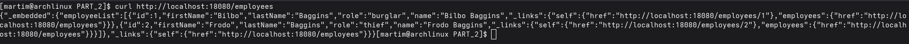

# Vagrant

Vagrant is a tool for building and managing virtual machine environments in a single workflow. It provides a simple and easy-to-use command-line interface to create and configure lightweight, reproducible, and portable development environments.

## Prerequisites
- Install [Vagrant](https://www.vagrantup.com/downloads)
- Install a virtualization provider like [VirtualBox](https://www.virtualbox.org/wiki/Downloads)
- (Optional) Install [Vagrant plugins](https://www.vagrantup.com/docs/plugins) if needed for your specific use case.

## Getting Started

1. **Create a Vagrantfile**: This file defines the configuration of your virtual machine. You can create a new directory for your project and run `vagrant init` to generate a basic Vagrantfile.

   ```bash
   mkdir PART_1/Vagrant
   cd my_vagrant_project
   vagrant init
   ```
2. **Configure the Vagrantfile**: Edit the Vagrantfile to specify the base box, network settings, and any provisioning scripts you want to run.
    ```ruby
    Vagrant.configure("2") do |config|
    config.vm.box = "ubuntu/jammy64"
    config.vm.synced_folder ".", "/vagrant"
    config.vm.provision "shell", path: "provision.sh"
    end
    ```
In this example, we are using the Ubuntu Jammy 64-bit box and syncing the current directory to `/vagrant` in the VM. We also specify a shell script for provisioning.
3. **Create a Dependency Script**: Create a script (e.g., `scripts/install-dependecies.sh`) to install any dependencies your project needs.

   ```
    #!/usr/bin/env bash
    set -e
    echo "==== Updating system packages ===="

    sudo apt-get update -y
    sudo apt-get install -y curl zip unzip git wget tar


    echo "==== Installing Java 17 ===="
    sudo apt-get install -y openjdk-17-jdk
    java -version


    echo "==== Installing Maven 3.9.3 ===="
    MAVEN_VERSION=3.9.3
    wget -q https://archive.apache.org/dist/maven/maven-3/$MAVEN_VERSION/binaries/apache-maven-$MAVEN_VERSION-bin.tar.gz -P /tmp
    sudo tar xf /tmp/apache-maven-$MAVEN_VERSION-bin.tar.gz -C /opt
    sudo ln -sf /opt/apache-maven-$MAVEN_VERSION /opt/maven
    #Add Maven to PATH
    echo 'export PATH=$PATH:/opt/maven/bin' | sudo tee /etc/profile.d/maven.sh
    sudo chmod +x /etc/profile.d/maven.sh
    source /etc/profile.d/maven.sh
    mvn -v

   echo "==== Installing Gradle 8.3 ===="
    GRADLE_VERSION=8.3
    wget -q https://services.gradle.org/distributions/gradle-$GRADLE_VERSION-bin.zip -P /tmp
    sudo unzip -d /opt/gradle /tmp/gradle-$GRADLE_VERSION-bin.zip
    sudo ln -sf /opt/gradle/gradle-$GRADLE_VERSION /opt/gradle/latest
    #Add Gradle to PATH
    echo 'export PATH=$PATH:/opt/gradle/latest/bin' | sudo tee /etc/profile.d/gradle.sh
    sudo chmod +x /etc/profile.d/gradle.sh
    source /etc/profile.d/gradle.sh
    gradle -v

    echo "==== Installation complete! ===="

   ```
3. **Create a Provisioning Script**: If you specified a provisioning script in the Vagrantfile, create that script (e.g., `provision.sh`) to install necessary software and configure the VM.

   ```
    #!/bin/bash
    # provision.sh

    echo "Starting main provisioning..."

    # Call the install script inside scripts/
    bash /vagrant/scripts/install-dependecies.sh
   ```

4. **Start the VM**: Run `vagrant up` to create and configure the virtual machine as defined in the Vagrantfile.

   ```bash
    vagrant up
    ```

5. **Access the VM**: Use `vagrant ssh` to log into the virtual machine.

   ```bash
    vagrant ssh
    ```
6. Create a SSH Key Pair: Inside the VM, generate a new SSH key pair if you don't have one already.

   ```bash
    ssh-keygen -t rsa -b 2048 -f ~/.ssh/id_rsa -q -N ""
    ```

7. Add the public key to github: Copy the contents of `~/.ssh/id_rsa.pub` and add it to your GitHub account under Settings > SSH and GPG keys.

This is because the repository is private and requires authentication to clone.


8. **Clone the Repository**: Inside the VM, clone the repository using SSH.

   ```bash
    git clone git@github.com:jpedroal11/cogsi2425-1211066-1250515-1181754-1220638.git
    cd cogsi2425-1211066-1250515-1181754-1220638/CA3/PART_2
    ```
9. **Build and Run the Application**: Follow the instructions in the README.md file of the cloned repository to build and run the application.

The project in CA3/PART_2 is the same for CA2/PART_2, so you can follow the same steps as in CA2/PART_2/README.md to build and run the application using Gradle.

Is necessary to change the Vagrantfile  so the host machine can access the application running inside the VM. You can do this by adding a port forwarding rule in the Vagrantfile:

```ruby
         config.vm.network "forwarded_port", guest: 8080, host: 18080
```
This is exposing the application running on port 8080 inside the VM to port 18080 on the host machine.

10. Build the application with:


```bash
         ./gradlew build
```

And test if it can reach the app on Vagrant:


```bash
         curl http://localhost:18080/employees
```




2. Automize build,clone and launch app

For this it was created different scripts for it to work:

- install-dependecies.sh :

```gradle
#!/usr/bin/env bash
set -e

# --- Configuration ---
PROJ_DIR="/home/vagrant/cogsi2425-1211066-1250515-1181754-1220638/CA3/PART_1/ca2-part2"
JAVA_HOME="/usr/lib/jvm/java-17-openjdk-amd64"
MAVEN_VERSION=3.9.3
GRADLE_VERSION=8.3

echo "=== Updating system packages ==="
sudo apt-get update -y
sudo apt-get install -y curl zip unzip git wget tar openjdk-17-jdk

# --- Set Java environment ---
echo "=== Setting up Java environment ==="
echo "export JAVA_HOME=$JAVA_HOME" | sudo tee /etc/profile.d/java.sh
echo 'export PATH=$JAVA_HOME/bin:$PATH' | sudo tee -a /etc/profile.d/java.sh
sudo chmod +x /etc/profile.d/java.sh
export JAVA_HOME=$JAVA_HOME
export PATH=$JAVA_HOME/bin:$PATH
java -version

# --- Install Maven ---
echo "=== Installing Maven $MAVEN_VERSION ==="
wget -q https://archive.apache.org/dist/maven/maven-3/$MAVEN_VERSION/binaries/apache-maven-$MAVEN_VERSION-bin.tar.gz -P /tmp
sudo tar xf /tmp/apache-maven-$MAVEN_VERSION-bin.tar.gz -C /opt
sudo ln -sf /opt/apache-maven-$MAVEN_VERSION /opt/maven
echo 'export PATH=$PATH:/opt/maven/bin' | sudo tee /etc/profile.d/maven.sh
sudo chmod +x /etc/profile.d/maven.sh
export PATH=$PATH:/opt/maven/bin
mvn -v

# --- Install Gradle ---
echo "=== Installing Gradle $GRADLE_VERSION ==="
wget -q https://services.gradle.org/distributions/gradle-$GRADLE_VERSION-bin.zip -O /tmp/gradle-$GRADLE_VERSION-bin.zip
sudo mkdir -p /opt/gradle
sudo unzip -o /tmp/gradle-$GRADLE_VERSION-bin.zip -d /opt/gradle
sudo ln -sf /opt/gradle/gradle-$GRADLE_VERSION /opt/gradle/latest
echo 'export PATH=$PATH:/opt/gradle/latest/bin' | sudo tee /etc/profile.d/gradle.sh
sudo chmod +x /etc/profile.d/gradle.sh
export PATH=$PATH:/opt/gradle/latest/bin
gradle -v


```
This is to build the required dependencies such as Maven, Gradle and Java


- git-clone.sh:


```gradle
#!/usr/bin/env bash
set -e

# Default target directory
PROJ_DIR="${PROJ_DIR:-/home/vagrant}"
REPO_NAME="cogsi2425-1211066-1250515-1181754-1220638"
REPO_URL="git@github.com:jpedroal11/${REPO_NAME}.git"
BRANCH_NAME="feature/vagrant-prt1"

echo "==== Cloning project repository ===="

# Ensure known_hosts contains GitHub’s fingerprint to avoid prompt
mkdir -p ~/.ssh
ssh-keyscan -H github.com >> ~/.ssh/known_hosts 2>/dev/null

if [ -d "$PROJ_DIR/$REPO_NAME/.git" ]; then
    echo "Repository already exists — fetching latest changes..."
    cd "$PROJ_DIR/$REPO_NAME"
    git fetch origin
else
    echo "Cloning new repository into $PROJ_DIR"
    mkdir -p "$PROJ_DIR"
    git clone "$REPO_URL" "$PROJ_DIR/$REPO_NAME"
    cd "$PROJ_DIR/$REPO_NAME"
fi

# Checkout the desired branch safely
if git show-ref --verify --quiet "refs/heads/$BRANCH_NAME"; then
    git checkout "$BRANCH_NAME"
    git pull origin "$BRANCH_NAME"
else
    git checkout -b "$BRANCH_NAME" "origin/$BRANCH_NAME"
fi

cd "$PROJ_DIR/$REPO_NAME"
echo "Repository cloned or updated successfully on branch '$BRANCH_NAME'."

```


Gets Github repo if it doesn'exist if it does it pull the latest update:


- build-app.sh:

```gradle
#!/usr/bin/env bash
set -e
GRADLE_VERSION=8.3
# Project directory
PROJ_DIR="/home/vagrant/cogsi2425-1211066-1250515-1181754-1220638/CA3/PART_1/ca2-part2/app"
JAVA_HOME="/usr/lib/jvm/java-17-openjdk-amd64"
PROJ_ROOT="/home/vagrant/cogsi2425-1211066-1250515-1181754-1220638/CA3/PART_1/ca2-part2"

echo "=== Building applications ==="

cd "$PROJ_DIR" || { echo "Project app directory $PROJ_DIR does not exist"; exit 1; }

cd "$PROJ_ROOT"
echo "=== Generating/updating Gradle wrapper to $GRADLE_VERSION ==="
gradle wrapper --gradle-version $GRADLE_VERSION
chmod +x ./gradlew

# Ensure Gradle wrapper is executable
if [ -f "./gradlew" ]; then
chmod +x ./gradlew
# Force Gradle wrapper to use correct Java
export JAVA_HOME=$JAVA_HOME
export PATH=$JAVA_HOME/bin:$PATH
echo "Using JAVA_HOME=$JAVA_HOME"
./gradlew clean build

else
echo "Gradle wrapper not found, using system Gradle"
export JAVA_HOME=$JAVA_HOME
export PATH=$JAVA_HOME/bin:$PATH
gradle clean build
fi

echo "=== Build complete ==="

```


To build the application


- start-services.sh :

```gradle

#!/usr/bin/env bash
set -e

PROJ_ROOT="/home/vagrant/cogsi2425-1211066-1250515-1181754-1220638/CA3/PART_1/ca2-part2"
cd "$PROJ_ROOT"
./gradlew runFromDist


```

To start the application 


3.Addd the references in the main provision.sh:
```gradle
#!/usr/bin/env bash
set -e

echo "==== Installing dependencies ===="
/vagrant/scripts/install-dependecies.sh

echo "==== Cloning repository ===="
/vagrant/scripts/git-clone.sh

echo "==== Configuring persistent H2 storage ===="
/vagrant/scripts/setup-h2-persistence.sh

echo "==== Building app ===="
/vagrant/scripts/build-app.sh

echo "==== Start ===="
/vagrant/scripts/start-services.sh
```

Add the script automatically creates the dependencies needed, updates repo or creates it , builds the app and finally it deploys it.