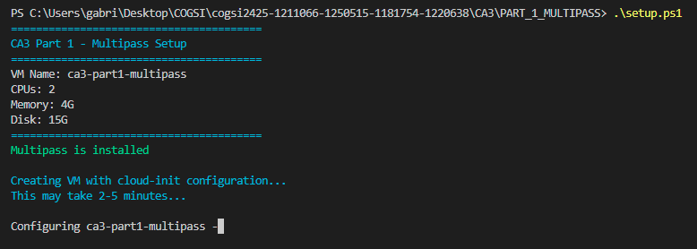
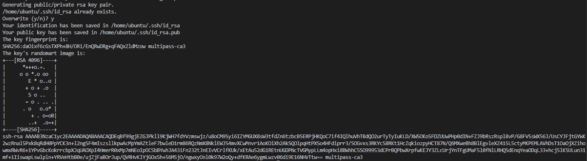
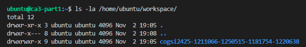
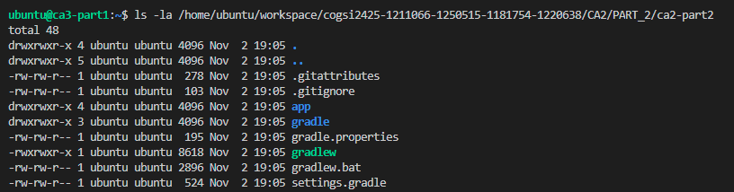
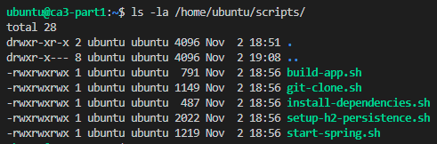
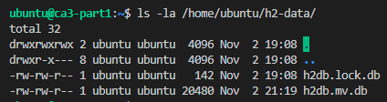
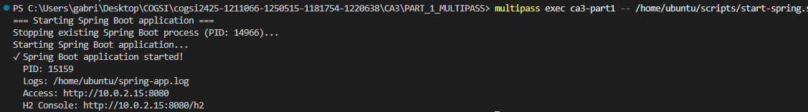

# CA3 Part 1 - Multipass Alternative

This project provides a **Multipass alternative** to Vagrant for CA3 Part 1. It automates the creation and provisioning of an Ubuntu VM that:

- Clones the project repository
- Builds the Spring Boot application from CA2 Part 2
- Configures persistent H2 database
- Runs the application automatically

**Different from Vagrant:** Multipass is lighter, cross-platform, and doesn't require VirtualBox. It uses cloud-init for provisioning instead of a Vagrantfile.

## Prerequisites

### Required Software

1. **Multipass** (version 1.13+)
   - Download: https://multipass.run/download/windows
   - Installation: Run installer as Administrator

2. **PowerShell** (Windows 10/11 built-in)

3. **GitHub Account** with SSH key access to the repository

### System Requirements

- **OS:** Windows 10/11, macOS, or Linux
- **RAM:** 4GB available (VM uses 4GB)
- **Disk:** 15GB available (VM uses 15GB)
- **CPU:** 2 cores available

---

## Project Structure

```
PART_1_MULTIPASS/
├── README.md                   # This file
├── cloud-init.yaml             # VM configuration (equivalent to Vagrantfile)
├── provision.sh                # Main provisioning orchestrator
├── setup.ps1                   # VM creation script (Windows)
├── run-provision.ps1           # Provisioning execution script (Windows)
│
└── scripts/                    # Modular provisioning scripts
    ├── install-dependencies.sh # Installs Java, Maven, Gradle
    ├── git-clone.sh            # Clones repository
    ├── setup-h2-persistence.sh # Configures H2 database
    ├── build-app.sh            # Builds Spring Boot application
    └── start-spring.sh         # Starts the application
```

## Quick Start

### 1. Clone or Navigate to Project

```powershell
cd CA3\PART_1_MULTIPASS
```

### 2. Create VM

```powershell
.\setup.ps1
```


This will:
- Create Ubuntu 22.04 VM
- Install Java 17, Maven 3.9.3, Gradle 8.3
- Upload all scripts

### 3. Setup SSH Key

```powershell
# Generate SSH key in VM
multipass exec ca3-part1 -- ssh-keygen -t rsa -b 2048 -f /home/ubuntu/.ssh/id_rsa -q -N ""

# Get public key
multipass exec ca3-part1 -- cat /home/ubuntu/.ssh/id_rsa.pub
```


**Copy the output** and add to GitHub:
1. Go to: https://github.com/settings/keys
2. Click "New SSH key"
3. Paste the key
4. Save


### 4. Run Provisioning

```powershell
.\run-provision.ps1
```

This will:
- Clone your repository
- Configure H2 persistence
- Build Spring Boot application
- Run tests

### 5. Verify Installation

Access the VM:

```powershell
multipass shell ca3-part1
```

Inside VM, check:

```bash
# Repository cloned
ls -la /home/ubuntu/workspace/
```



```bash
# CA2 code present
ls -la /home/ubuntu/workspace/cogsi2425-1211066-1250515-1181754-1220638/CA2/PART_2/ca2-part2/

```


```bash

# Scripts uploaded
ls -la /home/ubuntu/scripts/

```


```bash

# H2 database directory
ls -la /home/ubuntu/h2-data/
```


### 6. Start Application

```powershell
multipass exec ca3-part1 -- /home/ubuntu/scripts/start-spring.sh
```


### 7. Access Application

```powershell
# Get VM IP
multipass exec ca3-part1 -- hostname -I

# Access via shell (recommended for Windows)
multipass shell ca3-part1
```

### 8. Test Application

```bash
# Test API
curl http://localhost:8080/employees
```


### Step 9: Verify H2 Database Persistence

```bash
# Check database files
ls -lh /home/ubuntu/h2-data/
```

**Output:**
```
-rw-rw-r-- 1 ubuntu ubuntu  142 Nov  2 19:08 h2db.lock.db
-rw-rw-r-- 1 ubuntu ubuntu  20K Nov  2 21:19 h2db.mv.db
```

The presence of `h2db.mv.db` confirms the database is persisting data!

---

## Provisioning Scripts

### 1. `install-dependencies.sh`

Verifies that Java 17, Maven 3.9.3, and Gradle 8.3 are installed.

```bash
#!/usr/bin/env bash
set -e

# --- Configuration ---
JAVA_HOME="/usr/lib/jvm/java-17-openjdk-amd64"
MAVEN_VERSION=3.9.3
GRADLE_VERSION=8.3

echo "=== Verifying installed dependencies ==="

# Source environment
export JAVA_HOME=$JAVA_HOME
export PATH=$JAVA_HOME/bin:$PATH
export PATH=$PATH:/opt/maven/bin
export PATH=$PATH:/opt/gradle/latest/bin

echo "Java version:"
java -version

echo "Maven version:"
mvn -v

echo "Gradle version:"
gradle -v

echo "=== All dependencies verified! ==="
```

### 2. `git-clone.sh`

Clones the project repository into `/home/ubuntu/workspace/`.

```bash
#!/usr/bin/env bash
set -e

# Configuration
PROJ_DIR="${PROJ_DIR:-/home/ubuntu/workspace}"
REPO_NAME="cogsi2425-1211066-1250515-1181754-1220638"
REPO_URL="${REPO_URL:-git@github.com:jpedroal11/${REPO_NAME}.git}"
BRANCH_NAME="${BRANCH_NAME:-feature/vagrant-prt1}"

echo "==== Cloning project repository ===="
echo "Repository: $REPO_URL"
echo "Branch: $BRANCH_NAME"
echo "Target directory: $PROJ_DIR"

# Ensure known_hosts contains GitHub's fingerprint
mkdir -p ~/.ssh
ssh-keyscan -H github.com >> ~/.ssh/known_hosts 2>/dev/null

if [ -d "$PROJ_DIR/$REPO_NAME/.git" ]; then
    echo "Repository already exists — fetching latest changes..."
    cd "$PROJ_DIR/$REPO_NAME"
    git fetch origin
else
    echo "Cloning new repository..."
    mkdir -p "$PROJ_DIR"
    git clone "$REPO_URL" "$PROJ_DIR/$REPO_NAME"
    cd "$PROJ_DIR/$REPO_NAME"
fi

# Checkout the desired branch
if git show-ref --verify --quiet "refs/heads/$BRANCH_NAME"; then
    git checkout "$BRANCH_NAME"
    git pull origin "$BRANCH_NAME"
else
    git checkout -b "$BRANCH_NAME" "origin/$BRANCH_NAME"
fi

cd "$PROJ_DIR/$REPO_NAME"
echo "✓ Repository ready on branch '$BRANCH_NAME'"

```

### 3. `setup-h2-persistence.sh`

Configures Spring Boot to use a persistent file-based H2 database.

```bash
#!/usr/bin/env bash
set -e

# Directories
H2_DATA_DIR="/home/ubuntu/h2-data"
PROJ_DIR="${PROJ_DIR:-/home/ubuntu/workspace}"
REPO_NAME="cogsi2425-1211066-1250515-1181754-1220638"
APP_PROPERTIES="$PROJ_DIR/$REPO_NAME/CA3/PART_1/ca2-part2/app/src/main/resources/application.properties"
TEST_PROPERTIES="$PROJ_DIR/$REPO_NAME/CA3/PART_1/ca2-part2/app/src/integrationTest/resources/application-test.properties"

echo "=== Setting up persistent H2 database ==="

# Ensure H2 data directory exists
mkdir -p "$H2_DATA_DIR"
chmod 777 "$H2_DATA_DIR"

# Create application.properties directory
APP_DIR=$(dirname "$APP_PROPERTIES")
mkdir -p "$APP_DIR"

# Configure persistent H2 database
echo "Configuring application.properties for persistent H2..."

cat > "$APP_PROPERTIES" <<'EOF'
# =========================================
# H2 Persistent Database Configuration
# =========================================
spring.datasource.url=jdbc:h2:file:/home/ubuntu/h2-data/h2db;DB_CLOSE_DELAY=-1;AUTO_SERVER=TRUE
spring.datasource.driverClassName=org.h2.Driver
spring.datasource.username=sa
spring.datasource.password=password
spring.jpa.database-platform=org.hibernate.dialect.H2Dialect
spring.h2.console.enabled=true
spring.h2.console.path=/h2

# Hibernate auto DDL update
spring.jpa.hibernate.ddl-auto=update
EOF

# Configure test properties (in-memory)
echo "Configuring application-test.properties for in-memory H2..."
mkdir -p "$(dirname "$TEST_PROPERTIES")"

cat > "$TEST_PROPERTIES" <<'EOF'
# =========================================
# H2 In-Memory Database for Integration Tests
# =========================================
spring.datasource.url=jdbc:h2:mem:testdb;DB_CLOSE_DELAY=-1
spring.datasource.driverClassName=org.h2.Driver
spring.datasource.username=sa
spring.datasource.password=password
spring.jpa.database-platform=org.hibernate.dialect.H2Dialect
spring.jpa.hibernate.ddl-auto=create-drop
EOF

echo "✓ H2 persistence configured"
echo "  Database path: $H2_DATA_DIR/h2db.mv.db"
echo "  H2 console: http://VM_IP:8080/h2"
```

### 4. `build-app.sh`

Builds the Spring Boot application using Gradle.

```bash
#!/usr/bin/env bash
set -e

# Configuration
GRADLE_VERSION=8.3
PROJ_DIR="${PROJ_DIR:-/home/ubuntu/workspace}"
REPO_NAME="cogsi2425-1211066-1250515-1181754-1220638"
PROJ_ROOT="$PROJ_DIR/$REPO_NAME/CA3/PART_1/ca2-part2"
JAVA_HOME="/usr/lib/jvm/java-17-openjdk-amd64"

echo "=== Building Spring Boot application ==="

# Source environment
export JAVA_HOME=$JAVA_HOME
export PATH=$JAVA_HOME/bin:$PATH
export PATH=$PATH:/opt/gradle/latest/bin

cd "$PROJ_ROOT" || { echo "ERROR: Project directory not found: $PROJ_ROOT"; exit 1; }

# Generate Gradle wrapper
echo "Generating Gradle wrapper (version $GRADLE_VERSION)..."
gradle wrapper --gradle-version $GRADLE_VERSION
chmod +x ./gradlew

# Build the project
echo "Building project with Gradle..."
./gradlew clean build

echo "✓ Build complete!"
```

### 5. `start-spring.sh`

Starts the Spring Boot application in the background.

```bash
#!/usr/bin/env bash
set -e

# Configuration
PROJ_DIR="${PROJ_DIR:-/home/ubuntu/workspace}"
REPO_NAME="cogsi2425-1211066-1250515-1181754-1220638"
PROJ_ROOT="$PROJ_DIR/$REPO_NAME/CA3/PART_1/ca2-part2"
JAVA_HOME="/usr/lib/jvm/java-17-openjdk-amd64"

echo "=== Starting Spring Boot application ==="

# Source environment
export JAVA_HOME=$JAVA_HOME
export PATH=$JAVA_HOME/bin:$PATH

cd "$PROJ_ROOT" || { echo "ERROR: Project directory not found"; exit 1; }

# Kill existing process if running
if [ -f /home/ubuntu/spring-app.pid ]; then
    OLD_PID=$(cat /home/ubuntu/spring-app.pid)
    if kill -0 $OLD_PID 2>/dev/null; then
        echo "Stopping existing Spring Boot process (PID: $OLD_PID)..."
        kill $OLD_PID
        sleep 2
    fi
    rm /home/ubuntu/spring-app.pid
fi

# Start application in background
echo "Starting Spring Boot application..."
nohup ./gradlew bootRun > /home/ubuntu/spring-app.log 2>&1 &
echo $! > /home/ubuntu/spring-app.pid

sleep 5

VM_IP=$(hostname -I | awk '{print $1}')
echo "✓ Spring Boot application started!"
echo "  PID: $(cat /home/ubuntu/spring-app.pid)"
echo "  Logs: /home/ubuntu/spring-app.log"
echo "  Access: http://$VM_IP:8080"
echo "  H2 Console: http://$VM_IP:8080/h2"
```

### 6. `provision.sh`

Main orchestrator that calls all scripts in sequence.

```bash
#!/usr/bin/env bash
set -e

# Source environment variables
source /etc/profile.d/java.sh
source /etc/profile.d/maven.sh
source /etc/profile.d/gradle.sh

echo "========================================"
echo "CA3 Part 1 - Multipass Provisioning"
echo "========================================"

# Read environment variables
CLONE_REPO=${CLONE_REPO:-true}
BUILD_APP=${BUILD_APP:-true}
START_APP=${START_APP:-false}

# Script directory
SCRIPT_DIR="/home/ubuntu/scripts"

# Step 1: Verify dependencies
echo ""
echo "Step 1/5: Verifying dependencies..."
if [ -f "$SCRIPT_DIR/install-dependencies.sh" ]; then
    $SCRIPT_DIR/install-dependencies.sh
else
    echo "Warning: install-dependencies.sh not found"
fi

# Step 2: Clone repository (if enabled)
if [ "$CLONE_REPO" = "true" ]; then
    echo ""
    echo "Step 2/5: Cloning repository..."
    if [ -f "$SCRIPT_DIR/git-clone.sh" ]; then
        $SCRIPT_DIR/git-clone.sh
    else
        echo "ERROR: git-clone.sh not found!"
        exit 1
    fi
else
    echo ""
    echo "Step 2/5: Skipping repository clone (CLONE_REPO=false)"
fi

# Step 3: Setup H2 persistence
echo ""
echo "Step 3/5: Configuring H2 persistence..."
if [ -f "$SCRIPT_DIR/setup-h2-persistence.sh" ]; then
    $SCRIPT_DIR/setup-h2-persistence.sh
else
    echo "Warning: setup-h2-persistence.sh not found"
fi

# Step 4: Build application (if enabled)
if [ "$BUILD_APP" = "true" ]; then
    echo ""
    echo "Step 4/5: Building application..."
    if [ -f "$SCRIPT_DIR/build-app.sh" ]; then
        $SCRIPT_DIR/build-app.sh
    else
        echo "ERROR: build-app.sh not found!"
        exit 1
    fi
else
    echo ""
    echo "Step 4/5: Skipping build (BUILD_APP=false)"
fi

# Step 5: Start application (if enabled)
if [ "$START_APP" = "true" ]; then
    echo ""
    echo "Step 5/5: Starting application..."
    if [ -f "$SCRIPT_DIR/start-spring.sh" ]; then
        $SCRIPT_DIR/start-spring.sh
    else
        echo "Warning: start-spring.sh not found"
    fi
else
    echo ""
    echo "Step 5/5: Application not auto-started (START_APP=false)"
fi

echo ""
echo "========================================"
echo "✓ Provisioning complete!"
echo "========================================"
VM_IP=$(hostname -I | awk '{print $1}')
echo "VM IP: $VM_IP"
echo ""
echo "Useful commands:"
echo "  Start app: /home/ubuntu/scripts/start-spring.sh"
echo "  View logs: tail -f /home/ubuntu/spring-app.log"
echo ""
echo "Access points (from host):"
echo "  Spring Boot: http://$VM_IP:8080"
echo "  H2 Console:  http://$VM_IP:8080/h2"
echo "  JDBC URL:    jdbc:h2:file:/home/ubuntu/h2-data/h2db"
echo "========================================"
```

---

## Configuration

### Environment Variables

Set in `run-provision.ps1`:

| Variable | Default | Description |
|----------|---------|-------------|
| `REPO_URL` | `git@github.com:jpedroal11/...` | Repository SSH URL |
| `BRANCH_NAME` | `feature/vagrant-prt1` | Branch to clone |
| `CLONE_REPO` | `true` | Whether to clone repository |
| `BUILD_APP` | `true` | Whether to build application |
| `START_APP` | `false` | Whether to auto-start application |

### VM Specifications

Defined in `setup.ps1`:

| Parameter | Value |
|-----------|-------|
| **Name** | `ca3-part1-multipass` |
| **CPUs** | 2 |
| **Memory** | 4GB |
| **Disk** | 15GB |
| **OS** | Ubuntu 22.04 LTS |

---

## Useful Commands

### VM Management

```powershell
# Start VM
multipass start ca3-part1

# Stop VM
multipass stop ca3-part1

# Delete VM
multipass delete ca3-part1
multipass purge

# VM info
multipass info ca3-part1

# Access VM shell
multipass shell ca3-part1

# Execute command in VM
multipass exec ca3-part1 -- <command>
```

### Application Management

```powershell
# Start application
multipass exec ca3-part1 -- /home/ubuntu/scripts/start-spring.sh

# View logs
multipass exec ca3-part1 -- tail -f /home/ubuntu/spring-app.log

# Stop application
multipass exec ca3-part1 -- pkill -f "gradle bootRun"

# Check if running
multipass exec ca3-part1 -- ps aux | grep java
```

### File Transfer

```powershell
# Copy file TO VM
multipass transfer local-file.txt ca3-part1:/home/ubuntu/

# Copy file FROM VM
multipass transfer ca3-part1:/home/ubuntu/remote-file.txt ./
```

---

## Comparison with Vagrant

| Feature | Vagrant | Multipass |
|---------|---------|-----------|
| **Configuration File** | `Vagrantfile` (Ruby) | `cloud-init.yaml` (YAML) |
| **Hypervisor** | VirtualBox, VMware | Hyper-V, QEMU, VirtualBox |
| **Platform** | Windows, macOS, Linux | Windows, macOS, Linux |
| **Installation Size** | ~500MB (+ VirtualBox ~200MB) | ~150MB |
| **Synced Folders** | Built-in | Manual transfer |
| **Port Forwarding** | Easy (in Vagrantfile) | Manual (OS-specific) |
| **Provisioning** | Shell, Ansible, Chef, etc. | cloud-init, shell |
