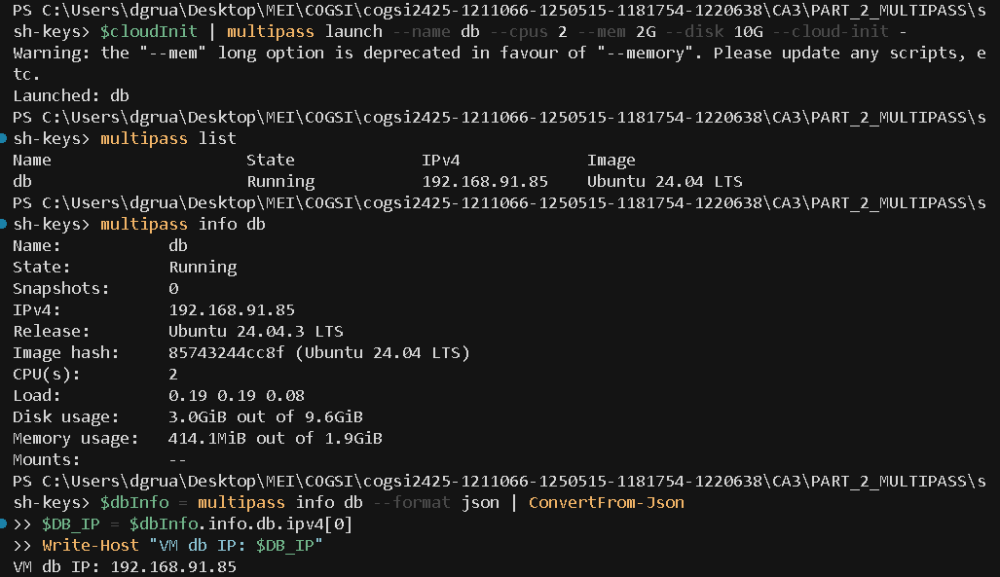
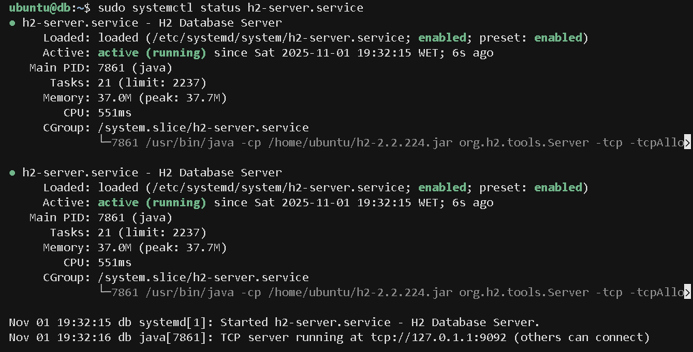
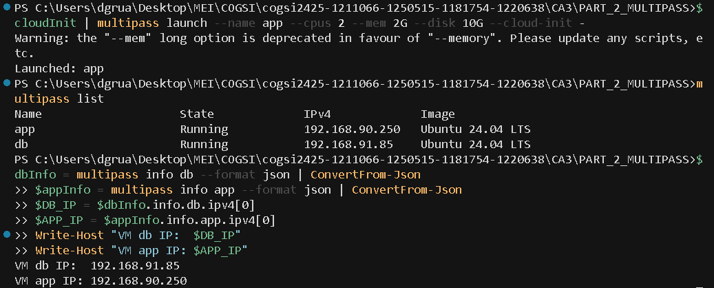
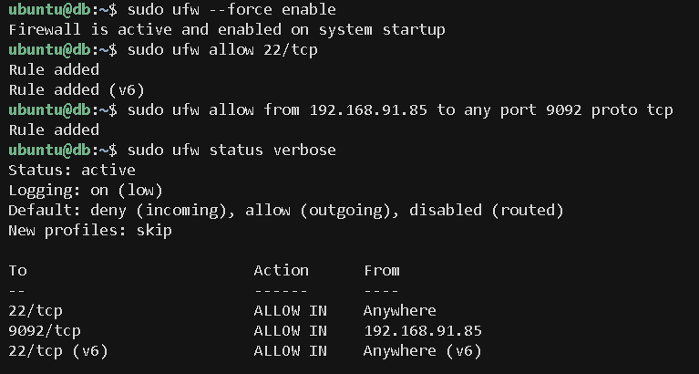
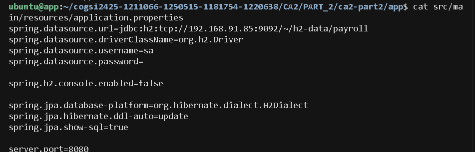
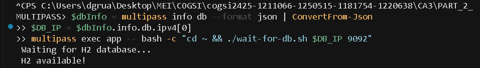
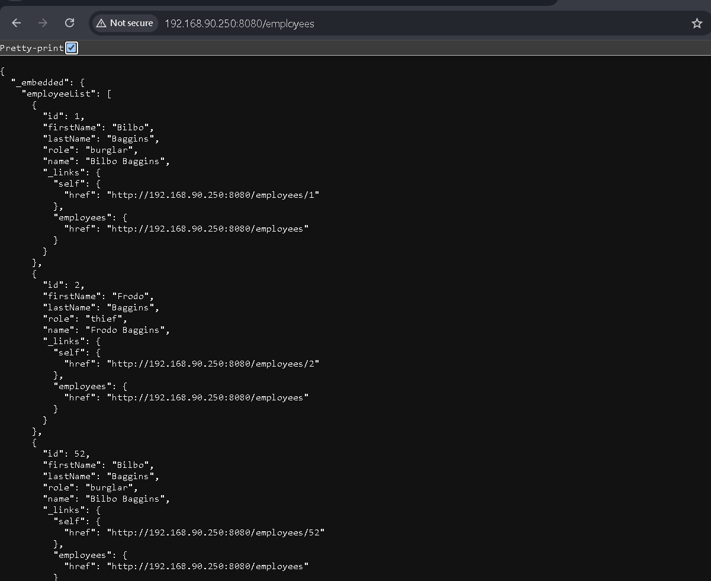
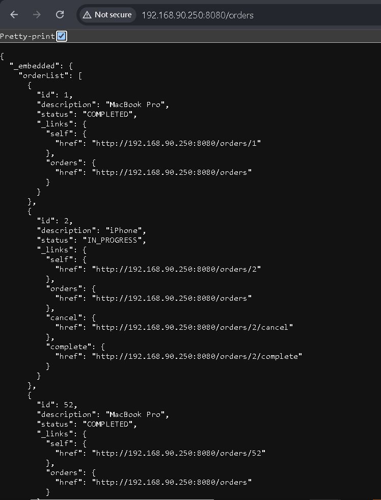

# CA3 Part 2 - Multipass (Alternative to Vagrant)

## Overview

Virtual environment setup with Multipass to run Spring Boot REST application with H2 in server mode.
- **VM db:** H2 Database Server
- **VM app:** Spring Boot Application

---

## Prerequisites

**Install Multipass:**
```powershell
choco install multipass
# or download from https://multipass.run/install
```

**Verify installation:**
```powershell
multipass version
```

---

## Step 1: Generate Custom SSH Keys

```powershell
# Create directory
New-Item -ItemType Directory -Force -Path ssh-keys
cd ssh-keys

# Generate RSA 4096 bits keys
ssh-keygen -t rsa -b 4096 -f multipass_key -C "multipass-ca3-part2"
# Press Enter twice (no passphrase)

# Verify
Get-ChildItem
Get-Content multipass_key.pub

cd ..
```


---

## Step 2: Create Database VM (db)

```powershell
# Get public key
$PUBLIC_KEY = Get-Content .\ssh-keys\multipass_key.pub -Raw

# Create cloud-init config
$cloudInit = @"
#cloud-config
users:
  - name: ubuntu
    ssh_authorized_keys:
      - $($PUBLIC_KEY.Trim())
    sudo: ALL=(ALL) NOPASSWD:ALL
package_update: true
package_upgrade: true
packages:
  - openjdk-17-jdk
  - ufw
  - netcat-openbsd
"@

# Create VM db (2 CPUs, 2GB RAM, 10GB Disk)
$cloudInit | multipass launch --name db --cpus 2 --mem 2G --disk 10G --cloud-init -

# Verify
multipass list
multipass info db
```

**Get VM db IP:**
```powershell
$dbInfo = multipass info db --format json | ConvertFrom-Json
$DB_IP = $dbInfo.info.db.ipv4[0]
Write-Host "VM db IP: $DB_IP"
```



---

## Step 3: Configure H2 in Server Mode

```powershell
# Access VM db
multipass shell db
```

**Inside VM db:**
```bash
# Download H2
cd ~
wget https://repo1.maven.org/maven2/com/h2database/h2/2.2.224/h2-2.2.224.jar
mkdir -p ~/h2-data

# Create systemd service
sudo tee /etc/systemd/system/h2-server.service > /dev/null <<'EOF'
[Unit]
Description=H2 Database Server
After=network.target

[Service]
Type=simple
User=ubuntu
WorkingDirectory=/home/ubuntu
ExecStart=/usr/bin/java -cp /home/ubuntu/h2-2.2.224.jar org.h2.tools.Server -tcp -tcpAllowOthers -tcpPort 9092 -baseDir /home/ubuntu/h2-data -ifNotExists
Restart=on-failure
RestartSec=5

[Install]
WantedBy=multi-user.target
EOF

# Start H2
sudo systemctl daemon-reload
sudo systemctl enable h2-server.service
sudo systemctl start h2-server.service

# Verify
sudo systemctl status h2-server.service
nc -z localhost 9092 && echo "H2 OK" || echo "H2 Failed"

exit
```



---

## Step 4: Create Application VM (app)

```powershell
# Get public key
$PUBLIC_KEY = Get-Content .\ssh-keys\multipass_key.pub -Raw

# Create cloud-init config
$cloudInit = @"
#cloud-config
users:
  - name: ubuntu
    ssh_authorized_keys:
      - $($PUBLIC_KEY.Trim())
    sudo: ALL=(ALL) NOPASSWD:ALL
package_update: true
package_upgrade: true
packages:
  - openjdk-17-jdk
  - curl
  - netcat-openbsd
"@

# Create VM app (2 CPUs, 2GB RAM, 10GB Disk)
$cloudInit | multipass launch --name app --cpus 2 --mem 2G --disk 10G --cloud-init -

# Get IPs
multipass list
$dbInfo = multipass info db --format json | ConvertFrom-Json
$appInfo = multipass info app --format json | ConvertFrom-Json
$DB_IP = $dbInfo.info.db.ipv4[0]
$APP_IP = $appInfo.info.app.ipv4[0]
Write-Host "VM db IP:  $DB_IP"
Write-Host "VM app IP: $APP_IP"
```



---

## Step 5: Configure Firewall (UFW)

```powershell
# Access VM db
multipass shell db
```

**Inside VM db (replace `<APP_IP>` with real IP):**
```bash
# Configure UFW
sudo ufw --force enable
sudo ufw allow 22/tcp
# In our case: sudo ufw allow from 192.168.90.250 to any port 9092 proto tcp
sudo ufw allow from <APP_IP> to any port 9092 proto tcp

# Verify
sudo ufw status verbose

exit
```



---

## Step 6: Get Project on VM app

**Option 1 - Clone from Git (Recommended):**
```powershell
multipass shell app
```

Inside VM app:
```bash
# Clone repository
cd ~
git clone https://github.com/<user>/<repo>.git
cd <repo>/CA2/PART_2/ca2-part2

# Verify
ls -la

exit
```

**Option 2 - Copy from local machine:**
```powershell
# If project not in git yet
multipass transfer -r CA2\PART_2\ca2-part2 app:/home/ubuntu/

# Verify
multipass exec app -- ls -la /home/ubuntu/ca2-part2/
```

---

## Step 7: Configure application.properties

```powershell
# Get VM db IP
$dbInfo = multipass info db --format json | ConvertFrom-Json
$DB_IP = $dbInfo.info.db.ipv4[0]
Write-Host "VM db IP:  $DB_IP"

# Access VM app
multipass shell app
```

**Inside VM app (replace `<DB_IP>` with real IP):**
```bash
# If cloned from git
cd ~/<repo>/CA2/PART_2/ca2-part2/app
# OR if copied locally
cd ~/ca2-part2/app

mkdir -p src/main/resources

# Create application.properties
# In our case: DB_IP=192.168.91.85
cat > src/main/resources/application.properties <<EOF
spring.datasource.url=jdbc:h2:tcp://<DB_IP>:9092/~/h2-data/payroll
spring.datasource.driverClassName=org.h2.Driver
spring.datasource.username=sa
spring.datasource.password=

spring.h2.console.enabled=false

spring.jpa.database-platform=org.hibernate.dialect.H2Dialect
spring.jpa.hibernate.ddl-auto=update
spring.jpa.show-sql=true

server.port=8080
EOF

# Verify
cat src/main/resources/application.properties

exit
```



---

## Step 8: Startup Check Script

```powershell
multipass shell app
```

**Inside VM app:**
```bash
cd ~
cat > wait-for-db.sh <<'EOF'
#!/bin/bash
set -e

DB_HOST=$1
DB_PORT=${2:-9092}

echo "⏳ Waiting for H2 database..."

MAX_WAIT=60
WAIT_TIME=0

while [ $WAIT_TIME -lt $MAX_WAIT ]; do
    if nc -z $DB_HOST $DB_PORT 2>/dev/null; then
        echo "✅ H2 available!"
        exit 0
    fi
    echo "   Trying... ($WAIT_TIME/$MAX_WAIT s)"
    sleep 2
    WAIT_TIME=$((WAIT_TIME + 2))
done

echo "❌ Timeout"
exit 1
EOF

chmod +x ~/wait-for-db.sh

exit
```

**Test startup check:**
```powershell
$dbInfo = multipass info db --format json | ConvertFrom-Json
$DB_IP = $dbInfo.info.db.ipv4[0]
multipass exec app -- bash -c "cd ~ && ./wait-for-db.sh $DB_IP 9092"
```



---

## Step 9: Compile and Run Application

```powershell
multipass shell app
```

**Inside VM app (replace `<DB_IP>`):**
```bash
# Go to project (adjust path as needed)
cd ~/cogsi2425-1211066-1250515-1181754-1220638/CA2/PART_2/ca2-part2

# Set executable permission
chmod +x gradlew

# Run startup check
# In our case: DB_IP=192.168.91.85 (replace with your db VM IP from Step 3)
DB_IP=<DB_IP>
cd ~
./wait-for-db.sh $DB_IP 9092

# Start application in background (bootRun compiles automatically)
cd ~/cogsi2425-1211066-1250515-1181754-1220638/CA2/PART_2/ca2-part2
nohup ./gradlew bootRun --no-daemon > ~/app.log 2>&1 &

# View logs
tail -f ~/app.log
# Ctrl+C to exit

exit
```

> **Note:** `./gradlew build` may fail due to Gradle 9.1.0/Spring Boot 3.3.0 incompatibility. However, `bootRun` works perfectly as it compiles and runs the application automatically.



---

## Step 10: Test Application

```powershell
# Test from VM app
multipass exec app -- curl http://localhost:8080/employees

# Test from Windows
$appInfo = multipass info app --format json | ConvertFrom-Json
$APP_IP = $appInfo.info.app.ipv4[0]
curl http://${APP_IP}:8080/employees
```

**Example response:**
```json
{
  "_embedded": {
    "employeeList": [
      {
        "id": 1,
        "name": "Bilbo Baggins",
        "role": "burglar"
      },
      {
        "id": 2,
        "name": "Frodo Baggins",
        "role": "thief"
      }
    ]
  }
}
```



---

## Final Verification

```powershell
# H2 status
multipass exec db -- sudo systemctl status h2-server.service

# Firewall status
multipass exec db -- sudo ufw status

# Application logs
multipass exec app -- tail -20 ~/app.log

# List VMs
multipass list
```

---

## Useful Commands

```powershell
# Manage VMs
multipass list
multipass info db
multipass shell db
multipass stop db app
multipass start db app
multipass restart db app

# Check services
multipass exec db -- sudo systemctl status h2-server.service
multipass exec app -- ps aux | grep PayrollApplication

# Logs
multipass exec db -- sudo journalctl -u h2-server.service -n 20
multipass exec app -- tail -f ~/app.log

# Restart application
multipass exec app -- pkill -f PayrollApplication
```

---

## Troubleshooting

**H2 not responding:**
```powershell
multipass exec db -- sudo systemctl restart h2-server.service
multipass exec db -- sudo journalctl -u h2-server.service -n 50
```

**App cannot connect to H2:**
- Check IP in `application.properties`
- Check firewall: `multipass exec db -- sudo ufw status`
- Check H2 running: `multipass exec db -- nc -z localhost 9092`

**Application won't start:**
```powershell
multipass exec app -- tail -100 ~/app.log
```

---

## Vagrant vs Multipass

| Aspect | Vagrant | Multipass |
|---------|---------|-----------|
| Provider | VirtualBox, VMware | Hyper-V (native Windows) |
| Configuration | Vagrantfile | Cloud-init + commands |
| Performance | Slower | Faster |
| Complexity | More configuration | Simpler |

---

## Checklist

- [x] Two VMs (db + app)  
- [x] H2 in server mode (port 9092)  
- [x] Adequate resources (2 CPUs, 2GB RAM, 10GB disk)  
- [x] Custom SSH keys (RSA 4096)  
- [x] Startup check implemented  
- [x] UFW Firewall (only app -> db)  
- [x] Inter-service communication  

---

## Alternative: Automated Deployment

As an alternative to the manual setup above, we can use automation scripts for quick deployment.

### Quick Start with Scripts

```powershell
# Run deployment script
.\scripts\deploy.ps1

# With custom repository
.\scripts\deploy.ps1 -RepoUrl https://github.com/user/repo.git

# Skip SSH key generation if already exists
.\scripts\deploy.ps1 -SkipKeys

# Show help
.\scripts\deploy.ps1 -Help
```

The automation script will:
1. Generate SSH keys
2. Create and configure DB VM with H2 server
3. Create and configure App VM with Spring Boot
4. Configure firewall rules (UFW)
5. Deploy and start the application

**After deployment completes, access:**
- Employees API: `http://<APP_IP>:8080/employees`
- Orders API: `http://<APP_IP>:8080/orders`

### Scripts Overview

**1. deploy.ps1** (PowerShell - Main orchestrator)
- Automates the entire setup process
- Creates VMs with cloud-init
- Transfers and executes setup scripts
- Configures firewall and starts services

**2. setup-db.sh** (Bash - Database configuration)
- Downloads and configures H2 server
- Creates systemd service
- Starts and verifies H2

**3. setup-app.sh** (Bash - Application configuration)
- Clones repository
- Configures application.properties
- Sets up Gradle 8.5
- Creates startup check script

### Script Parameters

```powershell
# Full syntax
.\scripts\deploy.ps1 [-RepoUrl <url>] [-SkipKeys] [-Help]

---

## Commit Tag

```powershell
git add .
git commit -m "CA3 Part 2: Setup Multipass with separate VMs (db + app)"
git tag ca3-part2
git push origin ca3-part2
```

---

## Clean Environment

```powershell
multipass stop db app
multipass delete db app
multipass purge
```
