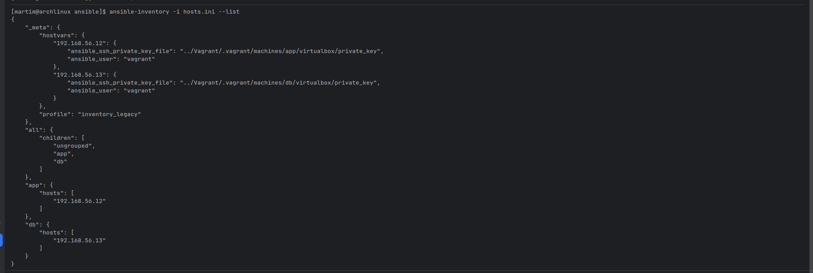
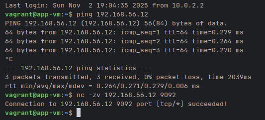
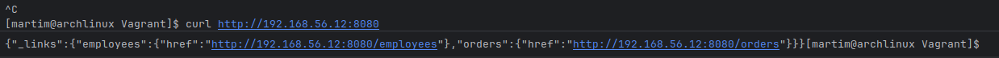
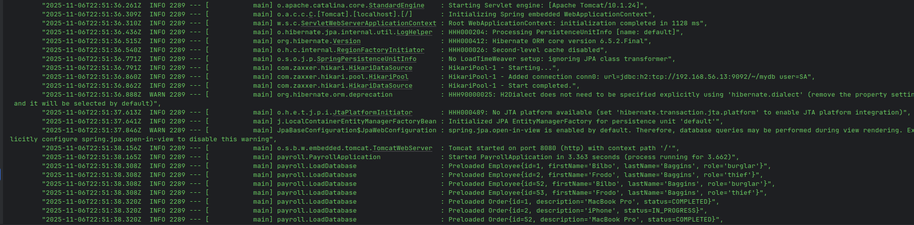
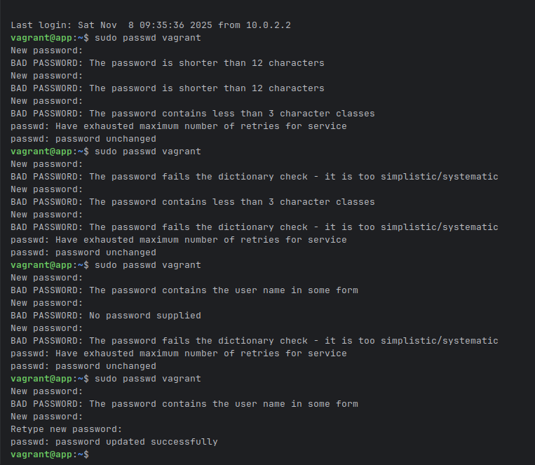
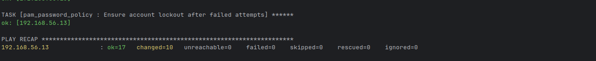
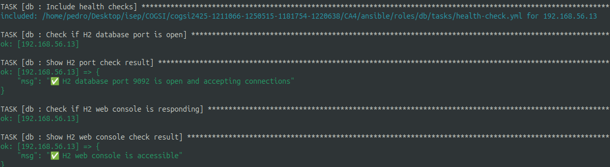

# Ansible
This repository contains Ansible playbooks and roles for automating the deployment and management of various systems and applications.

## Directory Structure
- `playbooks/`: Contains Ansible playbooks for different deployment scenarios.
- `roles/`: Contains reusable Ansible roles for specific tasks.
- `hosts.ini`: Contains  the target hosts.
- `roles/vars/`: Contains variable files for different environments.
- `roles/tasks/`: Contains task files for different roles.


## Setup VM

To set up the virtual machine for running the Ansible playbooks, follow these steps:
1. **Install Vagrant**:
   - Download and install [Vagrant](https://www.vagrantup.com/downloads)  on your host machine.

2. **Set up db VM**:
   - Navigate to the `CA4/Vagrant` directory in your terminal.
   - Run the following command to start the database VM:
     ```bash
     vagrant init
     ```
    - This will create a `Vagrantfile` in the current directory.
    - Edit the `Vagrantfile` to configure the VM settings as needed.
    
Add in the following content to the `Vagrantfile` to set up a database VM:

   ```ruby
   config.vm.define "db" do |db_vm|
     db_vm.vm.hostname = "db"
     db_vm.vm.network "private_network", ip: "192.168.56.13"

     db_vm.vm.provision "ansible" do |ansible|
       ansible.playbook = "../ansible/playbook.yml"
       ansible.limit = "db"
     end
   end
   ```
In this segment we define a VM named "db" with a private network IP address of `192.168.56.13`. 
The VM is provisioned using an Ansible playbook located at `../ansible/playbook.yml`, targeting the "db" host group defined in the inventory file `../ansible/hosts.ini`.

3. **Set up the app VM**:
   - Add the following content to the `Vagrantfile` to set up an application VM:

   ```ruby
    config.vm.define "app" do |app_vm|
    app_vm.vm.hostname = "app"
    app_vm.vm.network "private_network", ip: "192.168.56.12"

    app_vm.vm.provision "ansible" do |ansible|
      ansible.playbook = "../ansible/playbook.yml"
      ansible.limit = "app"
        end
    end
    ```

In this segment we define a VM named "app" with a private network IP address of `192.168.56.12`. The VM is provisioned using the same Ansible playbook located at `../ansible/playbook.yml`, targeting the "app" host group defined in the inventory file `../ansible/hosts.ini`.
## Setup Ansible Configuration
1. - Edit the `hosts.ini` file located in the `ansible` directory to define your target hosts and groups. For example:
   ```ini
    [app]
    192.168.56.12 ansible_user=vagrant ansible_ssh_private_key_file=../Vagrant/.vagrant/machines/app/virtualbox/private_key


    [db]
    192.168.56.13 ansible_user=vagrant ansible_ssh_private_key_file=../Vagrant/.vagrant/machines/db/virtualbox/private_key
    ```
   


This configuration defines two groups: `app` and `db`, each containing the respective VM's IP address and SSH connection details.
2. - Add the playbook file `playbook.yml` in the `ansible` directory to define the tasks to be executed on the target hosts. For example:
   ```yaml
   - name: Configure DB VM
     hosts: db
     become: yes
     roles:
       - db

   - name: Configure App VM
     hosts: app
     become: yes
     roles:
       - app

   - name: Enforce PAM password policy on all VMs
     hosts: app,db
     become: yes
     roles:
       - pam_password_policy
     ```

This playbook defines three plays:
- The first play targets the `db` group and applies the `db` role to configure the database VM.
- The second play targets the `app` group and applies the `app` role to configure the application VM.
- The third play targets both `app` and `db` groups to enforce PAM password policies using the `pam_password_policy` role.


3. Set up the roles:

- Create the necessary roles in the `roles` directory, such as `db`, `app`, and `pam_password_policy`. Each role should contain tasks, handlers, and variables as needed to perform the required configurations.
- For example, the directory structure for the `db` role could look like this:
```text
db/
└── tasks/
    ├── install-dependencies.yml
    └── main.yml
```

In install-dependencies.yml, you can define tasks to install necessary packages and dependencies on the VMs.
```yaml
# Update package cache
- apt: update_cache=yes cache_valid_time=3600

# Install dependencies
- apt: name=[openjdk-17-jdk, wget] state=present

# Create directory for H2
- file: path=/opt/h2 state=directory mode='0755'

# Download H2 JAR
- get_url:
    url: https://repo1.maven.org/maven2/com/h2database/h2/2.4.240/h2-2.4.240.jar
    dest: /opt/h2/h2.jar
    mode: '0755'
  register: download_result
  retries: 3
  delay: 5
  until: download_result is succeeded

# Create directory for database files
- file: path=/home/vagrant/mydb state=directory mode='0755' owner=vagrant group=vagrant

# Check if H2 is running on port 9092
- shell: ss -tln | awk '{print $4}' | grep -q ':9092' && echo "running" || echo "stopped"
  register: h2_status
  changed_when: false

# Start H2 TCP server if not running
- shell: |
    nohup java -cp /opt/h2/h2.jar org.h2.tools.Server \
      -tcp -tcpAllowOthers -tcpPort 9092 \
      -web -webAllowOthers -webPort 8082 \
      -ifNotExists > /opt/h2/h2.log 2>&1 &
  args: { chdir: /opt/h2 }
  when: "'stopped' in h2_status.stdout"

# Display H2 info
- debug:
    msg: |
      ✅ H2 Database running:
      - TCP port: 9092
      - Web Console: http://192.168.56.13:8082
      - JDBC URL: jdbc:h2:tcp://192.168.56.13:9092//home/vagrant/mydb/mydb
```
- In main.yml, you can include the install-dependencies.yml file to execute the tasks.
```yaml

- name: Install dependencies
  include_tasks: install-dependencies.yml
```
- App Vm can reach the DB VM:



And the directory structure for the `app` role could look like this:
```text
app/
└── tasks/
    ├── install-dependencies.yml
    └── main.yml
    └── build-and-run.yml
    └── git-clone.yml
└── vars/
    └── main.yml
```

In install-dependencies.yml, you can define tasks to install necessary packages and dependencies on the VMs.
```yaml

  # Show start message
  - debug:
      msg: "🚀 Starting App VM provisioning..."

  # Update apt repositories
  - apt:
      update_cache: yes
    environment:
      DEBIAN_FRONTEND: noninteractive
    register: apt_update

  # Print apt update result
  - debug:
      var: apt_update

  # Install dependencies (Java, Git, Gradle)
  - apt:
      name: [openjdk-17-jdk, git, gradle]
      state: present
    environment:
      DEBIAN_FRONTEND: noninteractive
    register: install_result

  # Print installation result
  - debug:
      var: install_result

  # Verify installations
  - shell: |
      java -version
      git --version
      gradle -v
    register: verify_output
    ignore_errors: yes

  # Show installed versions
  - debug:
      var: verify_output.stdout_lines

  # Finished provisioning
  - debug:
      msg: "✅ App VM setup completed successfully!"
```


In git-clone.yml, you can define tasks to clone the application repository.
```yaml
# Show start message
- debug:
    msg: "📦 Starting app repository setup..."

# Ensure app directory exists
- file:
    path: "{{ app_dir }}"
    state: directory
    owner: vagrant
    group: vagrant
    mode: '0755'

# Clone or update the app repository
- git:
    repo: "{{ repo_url }}"
    dest: "{{ app_dir }}"
    version: main
    force: yes
  register: git_result

# Show git clone/update result
- debug:
    var: git_result.after

# List files in the app directory (for debugging)
- shell: ls -la "{{ app_dir }}"
  register: dir_listing

# Show directory contents
- debug:
    var: dir_listing.stdout_lines

# Finished cloning
- debug:
    msg: "✅ Repository cloned or updated successfully!"

```

In build-and-run.yml, you can define tasks to build and run the application.
```yaml
# Show start message
- debug:
    msg: "📦 Starting app repository setup..."

# Ensure app directory exists
- file:
    path: "{{ app_dir }}"
    state: directory
    owner: vagrant
    group: vagrant
    mode: '0755'

# Clone or update the app repository
- git:
    repo: "{{ repo_url }}"
    dest: "{{ app_dir }}"
    version: main
    force: yes
  register: git_result

# Show git clone/update result
- debug:
    var: git_result.after

# List files in the app directory (for debugging)
- shell: ls -la "{{ app_dir }}"
  register: dir_listing

# Show directory contents
- debug:
    var: dir_listing.stdout_lines

# Finished cloning
- debug:
    msg: "✅ Repository cloned or updated successfully!"
```

In main.yml, you can include the install-dependencies.yml, git-clone.yml, and build-and-run.yml files to execute the tasks.
```yaml

- name: Include dependency installation steps
  include_tasks: install-dependencies.yml

- name: Include git clone steps
  include_tasks: git-clone.yml

- name: Include build application steps
  include_tasks: build-and-run.yml
```
Use the vars/main.yml file to define variables for the role.
```yaml
java_package: "openjdk-17-jdk"
gradle_version: " 8.14.3"
repo_url: "https://github.com/jpedroal11/cogsi2425-1211066-1250515-1181754-1220638.git"
app_dir: "/home/vagrant/app"
project_dir: "{{ app_dir }}/CA4/ca2-part2/"
```


- App is running:

[]


- Spring Boot App logs displaying connection to H2 Database:

[]

And also create the `pam_password_policy` role to enforce PAM password policies across all VMs.

```text
pam_password_policy/
└── tasks/
    ├── main.yml
```
In main.yml, you can define tasks to enforce PAM password policies.
```yaml
# Install required PAM-related packages
- apt:
    name:
      - libpam-pwquality
      - libpam-modules
    state: present
  become: yes

# Configure password complexity policy
- template:
    src: pwquality.conf.j2
    dest: /etc/security/pwquality.conf
    owner: root
    group: root
    mode: '0644'
  become: yes

# Configure account lockout policy
- template:
    src: faillock.conf.j2
    dest: /etc/security/faillock.conf
    owner: root
    group: root
    mode: '0644'
  become: yes

# Ensure PAM uses pwquality (for password strength)
- lineinfile:
    path: /etc/pam.d/common-password
    regexp: '^password\s+requisite\s+pam_pwquality.so'
    line: 'password requisite pam_pwquality.so retry=3 enforce_for_root'
    state: present
    backrefs: yes
  become: yes

# Configure pam_unix for password history (remember last 5)
- lineinfile:
    path: /etc/pam.d/common-password
    regexp: '^password\s+requisite\s+pam_unix.so'
    line: 'password [success=1 default=ignore] pam_unix.so remember=5 sha512'
    state: present
    backrefs: yes
  become: yes

# Ensure account lockout after failed login attempts
- lineinfile:
    path: /etc/pam.d/common-auth
    regexp: '^auth\s+required\s+pam_tally2.so'
    line: 'auth required pam_faillock.so preauth silent deny=5 unlock_time=600'
    state: present
    backrefs: yes
  become: yes
```
Using the folwing configurations in the templates directory:
```text
# Lock account for 10 minutes after 5 failed attempts
deny = 5
unlock_time = 600
fail_interval = 900
```

``` text
# Minimum password length
minlen = 12

# Require at least 3 of 4 character classes
minclass = 3

# Reject dictionary words
dictcheck = 1

# Prevent passwords containing username
usercheck = 1

```

- PAM Policie being enforced:




## Idempotency in Ansible Playbooks
In here to ensure  that the playbooks are idempotent we use the folwing:

``` yaml 
- name: Build the Spring Boot app using Gradle wrapper
  shell: ./gradlew clean build -x test -x integrationTest --no-daemon
  args:
  chdir: "{{ project_dir }}"
  environment:
  JAVA_HOME: /usr/lib/jvm/java-17-openjdk-amd64
  PATH: "{{ ansible_env.PATH }}:/usr/lib/jvm/java-17-openjdk-amd64/bin"
  register: build_output
  changed_when: "'BUILD SUCCESSFUL' in build_output.stdout"
  poll: 10

```
- In here we use the `changed_when` directive to specify that the task should be considered "changed" only if the build output contains the string 'BUILD SUCCESSFUL'. This way, if the build is successful, Ansible will report that a change has occurred; otherwise, it will report no change.
- We also use `poll` to set the polling interval for checking the task's status, which can help manage long-running tasks like builds.
- This approach helps ensure that the playbook can be run multiple times without causing unnecessary rebuilds if the application is already up to date.


```yaml
- name: Update apt cache
  apt:
    update_cache: yes
    cache_valid_time: 3600
 ```

In here we use the `cache_valid_time` parameter to specify that the apt cache should be considered valid for 3600 seconds (1 hour). This means that if the cache was updated within the last hour, Ansible will not attempt to update it again, helping to reduce unnecessary operations and improve idempotency.

```yaml
- name: Install dependencies (Java 17 + wget)
  apt:
    name:
      - openjdk-17-jdk
      - wget
    state: present
```

In here we use the `state: present` directive to ensure that the specified packages (Java 17 and wget) are installed. If they are already installed, Ansible will not attempt to reinstall them, thus maintaining idempotency.

```yaml
- name: Download H2 Database JAR
  get_url:
    url: https://repo1.maven.org/maven2/com/h2database/h2/2.4.240/h2-2.4.240.jar
    dest: /opt/h2/h2.jar
    mode: '0755'
  register: download_result
  retries: 3
  delay: 5
  until: download_result is succeeded
```
In here we use the `get_url` module to download the H2 Database JAR file. The task is idempotent because Ansible will only download the file if it does not already exist at the specified destination (`/opt/h2/h2.jar`). If the file is already present, Ansible will skip the download, ensuring that running the playbook multiple times does not result in redundant downloads.


- Displaying idempotency when re-running the playbook:




## User and Group Management with Secure Directory Access

Implemented Ansible automation to create a **developers** group and **devuser** user on both VMs, with secure directory permissions ensuring only group members can access application and database files.

### Implementation details

#### 1. Common Role for User/Group Management

- File: roles/common/tasks/users-groups.yml

- Purpose: Creates developers group and devuser user on both app and db VMs

- Tasks:

```yaml
- name: Create developers group
  group:
    name: developers
    state: present

- name: Create devuser
  user:
    name: devuser
    groups: developers
    append: yes
    shell: /bin/bash
    state: present
```


#### 2. Secure Directory Permissions

- App VM (roles/app/tasks/git-clone.yml):

```yaml
- name: Change ownership of app directory to devuser:developers
  file:
    path: "{{ app_dir }}"
    owner: devuser
    group: developers
    recurse: yes
    mode: '0750'
```    
- DB VM (roles/db/tasks/install-dependencies.yml):

```yaml
- name: Change ownership of database directory to devuser:developers
  file:
    path: /home/vagrant/mydb
    owner: devuser
    group: developers
    recurse: yes
    mode: '0750'

- name: Change ownership of H2 directory to devuser:developers
  file:
    path: /opt/h2
    owner: devuser
    group: developers
    recurse: yes
    mode: '0750'
```    


#### 3. Git Security Fix

Added task to handle Git security when changing directory ownership:

```yaml
- name: Fix Git security for directory ownership change
  shell: git config --global --add safe.directory "{{ app_dir }}"
  args:
    chdir: "{{ app_dir }}"
  ignore_errors: yes
```

Security Results:

- App Directory: /home/vagrant/app - Owned by devuser:developers with 750 permissions

- Database Directories: /home/vagrant/mydb and /opt/h2 - Owned by devuser:developers with 750 permissions

- Access Control: Only devuser and developers group members can access these directories


## Health Check Implementation

Implemented comprehensive health checks to verify both Spring Boot application and H2 database are running correctly and responding to requests.

### Implementation Details
1. App VM Health Check (roles/app/tasks/health-check.yml)

    - Purpose: Verify Spring Boot REST API is responding successfully

Implementation:

```yaml
- name: Check if Spring Boot app is responding
  uri:
    url: "http://localhost:8080/employees"
    method: GET
    status_code: 200
    timeout: 30
  register: health_check
  retries: 5
  delay: 10
  until: health_check.status == 200
  ignore_errors: yes
```

2. DB VM Health Check (roles/db/tasks/health-check.yml)

    - Purpose: Verify H2 database port is open and web console is accessible

Implementation:

```yaml
- name: Check if H2 database port is open
  wait_for:
    port: 9092
    host: "{{ ansible_default_ipv4.address }}"
    delay: 5
    timeout: 30
    state: started

- name: Check if H2 web console is responding
  uri:
    url: "http://localhost:8082"
    method: GET
    status_code: 200, 401, 302
    timeout: 10
```

Health Check Results

- App VM: ✅ HTTP 200 response from http://localhost:8080/employees

- DB VM: ✅ Port 9092 open and accepting connections

- DB VM: ✅ H2 web console accessible on port 8082

### Playbook Execution Order
Updated playbook to ensure proper dependency management:

```yaml
- name: Configure common settings on all VMs  
  hosts: app,db
  become: yes
  roles:
    - common

- name: Configure DB VM                       
  hosts: db
  become: yes
  roles:
    - db

- name: Configure App VM                      
  hosts: app
  become: yes
  roles:
    - app
```


