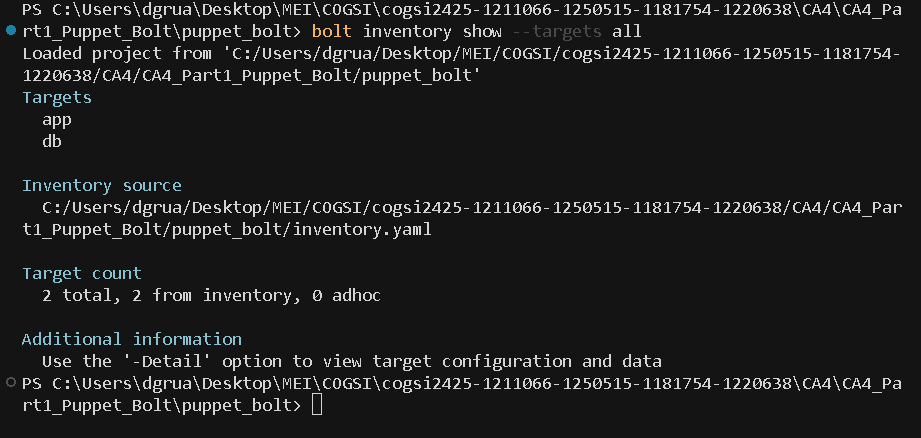
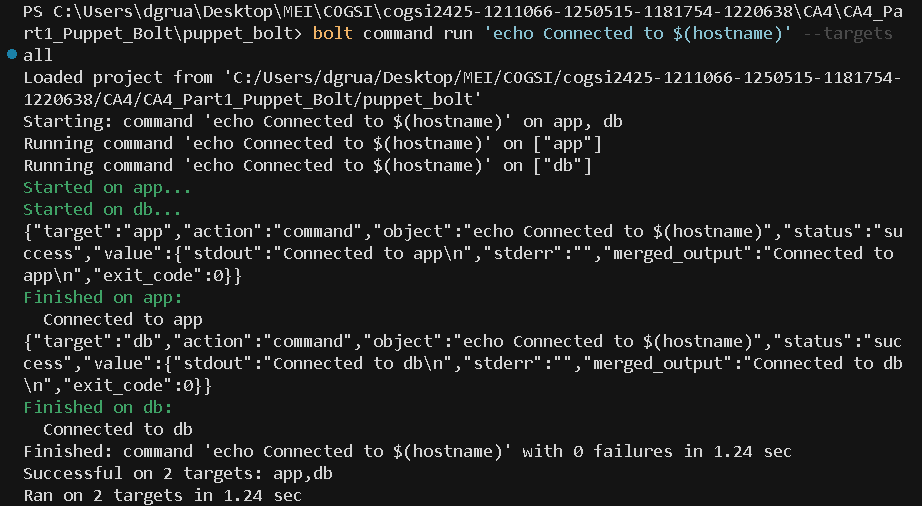
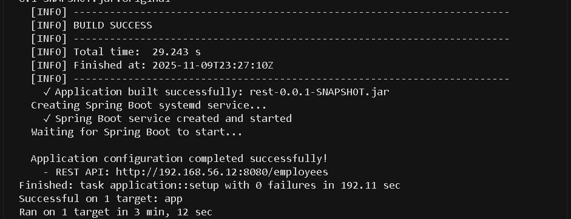

# Puppet Bolt - Ansible Alternative

This repository contains the alternative implementation of CA4 using **Puppet Bolt** as the configuration management tool instead of Ansible. Puppet Bolt is an open-source, agentless orchestration tool that allows you to automate tasks across your infrastructure using SSH.

The implementation follows the same requirements as the Ansible version:
- Deploy H2 Database server on VM1 (db)
- Deploy Spring Boot REST application on VM2 (app)
- Enforce PAM password policies on both VMs
- Create developers group and devuser with secure permissions
- Implement health checks to verify services
  
---

## Why Puppet Bolt?

Puppet Bolt was chosen as an alternative to Ansible because:

| Feature | Description |
|---------|-------------|
| **Declarative Paradigm** | Define desired state, not procedural steps |
| **Idempotency by Design** | Resources are inherently idempotent |
| **Automatic Dependencies** | Handles resource relationships automatically |
| **Strong Type System** | Prevents configuration errors |

### Key Differences from Ansible

| Aspect | Ansible | Puppet Bolt |
|--------|---------|-------------|
| **Language** | YAML | Puppet DSL (Ruby-based) |
| **Paradigm** | Procedural | Declarative |
| **Execution** | Sequential | Dependency graph |
| **Idempotency** | Manual (`changed_when`) | Automatic (built-in) |
| **State** | Stateless | Can be stateful |
| **Learning Curve** | Easy | Moderate |

---

## Installation

### Ubuntu/Debian
```bash
# Download and install Puppet repository
wget https://apt.puppet.com/puppet-tools-release-jammy.deb
sudo dpkg -i puppet-tools-release-jammy.deb

# Update package list
sudo apt-get update

# Install Puppet Bolt
sudo apt-get install puppet-bolt -y

# Verify installation
bolt --version
```

### Alternative: Using snap
```bash
sudo snap install puppet-bolt --classic
bolt --version
```

---

## Project Structure
```
puppet_bolt/
├── bolt-project.yaml              # Bolt project configuration
├── inventory.yaml                 # Target VMs inventory (app, db)
│
├── plans/                         # Bolt plans (orchestration workflows)
│   └── deploy.pp                  # Main deployment plan (4 steps)
│
├── modules/                       # Puppet modules
│   │
│   ├── common/                    # Common configuration module
│   │   ├── manifests/
│   │   │   └── init.pp            # Users, groups, PAM configuration
│   │   └── templates/
│   │       ├── pwquality.conf.epp # Password quality requirements
│   │       └── faillock.conf.epp  # Account lockout policy
│   │
│   ├── database/                  # H2 Database module
│   │   └── manifests/
│   │       └── init.pp            # H2 installation & systemd service
│   │
│   ├── application/               # Spring Boot application module
│   │   └── manifests/
│   │       └── init.pp            # Git clone, Maven build, deployment
│   │
│   └── healthcheck/               # Health check module
│       └── tasks/
│           ├── check_app.sh       # Application health verification
│           └── check_db.sh        # Database health verification
│
├── scripts/                       # Utility scripts
│   └── test_idempotency.sh        # Idempotency testing script
│
└── outputs/                       # Documentation and logs
    └── screenshots/               # Deployment screenshots
        ├── 01_connectivity.png    # SSH connectivity test
        ├── 02_inventory.png       # Inventory verification
        ├── 03_first_deployment.png    # Initial deployment
        └── 04_second_deployment.png   # Idempotency verification
```

---

## Configuration

### Inventory Setup

The `inventory.yaml` file defines target hosts:
```yaml
version: 2

groups:
  - name: all_vms
    targets:
      - name: app
        uri: 192.168.56.12
        config:
          transport: ssh
          ssh:
            user: vagrant
            private-key: ../../Vagrant/.vagrant/machines/app/virtualbox/private_key
            run-as: root
          
      - name: db
        uri: 192.168.56.13
        config:
          transport: ssh
          ssh:
            user: vagrant
            private-key: ../../Vagrant/.vagrant/machines/db/virtualbox/private_key
            run-as: root
```

**Verify inventory:**
```bash
bolt inventory show --targets all_vms
```



*The inventory shows both VMs (app and db) with their configuration.*

---

## Implementation

### Common Module

Configures settings for all VMs:
- Creates `developers` group (GID 3000)
- Creates `devuser` (UID 3000)
- Configures PAM password policy

**PAM Policy Requirements:**
- **Minimum length:** 12 characters
- **Character classes:** At least 3 of 4 (uppercase, lowercase, digits, symbols)
- **Dictionary check:** Enabled
- **Username check:** Enabled
- **Password history:** Last 5 passwords remembered
- **Account lockout:** 5 failed attempts = 10 minute lockout

```puppet
class common {
  group { 'developers':
    ensure => present,
    gid    => 3000,
  }

  user { 'devuser':
    ensure     => present,
    uid        => 3000,
    groups     => ['developers'],
    managehome => true,
    shell      => '/bin/bash',
    require    => Group['developers'],
  }

  # PAM configuration
  file { '/etc/security/pwquality.conf':
    ensure  => file,
    content => epp('common/pwquality.conf.epp'),
  }
}
```

### Database Module

Deploys H2 Database server:
- Installs Java 17
- Downloads H2 JAR file
- Creates systemd service
- Sets permissions to devuser:developers (mode 750)

```puppet
class database {
  package { 'openjdk-17-jdk':
    ensure => installed,
  }

  exec { 'download_h2':
    command => '/usr/bin/wget https://.../h2.jar -O /opt/h2/h2.jar',
    creates => '/opt/h2/h2.jar',
  }

  service { 'h2':
    ensure => running,
    enable => true,
  }
}
```

### Application Module

Deploys Spring Boot application:
- Clones repository from GitHub
- Builds with Gradle
- Creates systemd service
- Sets permissions to devuser:developers (mode 750)

```puppet
class application {
  exec { 'git_clone_app':
    command => "/usr/bin/git clone ${repo_url} ${app_dir}/repo",
    creates => "${app_dir}/repo/.git",
  }

  exec { 'gradle_build':
    command => "${project_dir}/gradlew clean build",
    creates => "${project_dir}/build/libs/*.jar",
  }

  service { 'springboot':
    ensure => running,
    enable => true,
  }
}
```

---

## Deployment

### Test Connectivity

Before deploying, verify SSH connectivity:

```bash
bolt command run 'echo "Connected to $(hostname)"' --targets all_vms
```



*Both VMs respond successfully, confirming SSH access.*

---

### Run Deployment

Execute the main deployment plan:
```bash
bolt plan run deploy --targets all_vms
```

**Deployment Steps:**
1. **Common configuration** - Users, groups, PAM policy
2. **Database setup** - H2 installation and service
3. **Application setup** - Spring Boot build and deployment
4. **Health checks** - Verify services are running

#### First Run



*First run shows multiple changes as resources are created and configured.*

**First Run Summary:**
- Total time: ~29 seconds (29.243s)
- Application built successfully
- Spring Boot service created and started
- REST API available at: http://192.168.56.12:8080/employees

---

## Outputs

### Idempotency Verification

One of Puppet's core strengths is built-in idempotency. Running the deployment again should show minimal or no changes.
```bash
# Second run
bolt plan run deploy --targets all_vms
```

#### Second Run (Idempotency)


*Second run shows minimal changes, proving idempotency.*

**Idempotency Analysis:**

| Metric | First Run | Second Run |
|--------|-----------|------------|
| **Duration** | 29.24s | 21.22s |
| **Result** | Multiple changes | Minimal changes |
| **Build** | Full build | No rebuild (already exists) |

**Key Observations:**
- Resources like `package`, `file`, `service` are idempotent by design
- The `exec` resource uses `creates` parameter to ensure idempotency
- No redundant builds or downloads on subsequent runs
- Services only restart if configuration changes

---

### PAM Password Policy

Verify PAM configuration:
```bash
bolt command run 'cat /etc/security/pwquality.conf' --targets all_vms
```

**Expected Output:**
```
minlen = 12
minclass = 3
dictcheck = 1
usercheck = 1
```

**Testing Password Policy:**
```bash
sudo passwd vagrant
# Try: "weak123" → REJECTED (too short, dictionary word)
# Try: "Abc123!@Xyz456" → ACCEPTED
```

**Sample rejection messages:**
```
BAD PASSWORD: The password is shorter than 12 characters
BAD PASSWORD: The password contains less than 3 character classes
BAD PASSWORD: The password fails the dictionary check
```

---

### Users and Groups Management

Verify user and group creation:
```bash
bolt command run 'id devuser' --targets all_vms
bolt command run 'getent group developers' --targets all_vms
```

**Expected Output:**
```
uid=3000(devuser) gid=3000(developers) groups=3000(developers)
developers:x:3000:devuser
```

**User Details:**
- **Username:** devuser
- **UID:** 3000
- **Primary Group:** developers (GID: 3000)
- **Home Directory:** /home/devuser
- **Shell:** /bin/bash

---

### Directory Permissions

Verify secure directory permissions:
```bash
bolt command run 'ls -la /opt/h2' --targets db
bolt command run 'ls -la /home/vagrant/app' --targets app
```

**Expected Output:**
```
drwxr-x--- 2 devuser developers 4096 Nov  9 23:38 /opt/h2
drwxr-x--- 8 devuser developers 4096 Nov  9 23:38 /home/vagrant/app
```

**Permission Summary:**

| Directory | Owner | Group | Mode | Description |
|-----------|-------|-------|------|-------------|
| `/opt/h2` | devuser | developers | 750 | H2 database binaries |
| `/home/vagrant/mydb` | devuser | developers | 750 | H2 database files |
| `/home/vagrant/app` | devuser | developers | 750 | Spring Boot application |

**Permission Breakdown (750):**
- **Owner (7):** Read, Write, Execute
- **Group (5):** Read, Execute
- **Others (0):** No access

---

### Health Checks

Verify services are running:
```bash
bolt command run 'systemctl status h2 --no-pager' --targets db
bolt command run 'systemctl status springboot --no-pager' --targets app
```

**Health Check Results:**

#### Database VM (H2)
```bash
bolt command run 'systemctl is-active h2 && ss -tln | grep :9092' --targets db
```

Expected:
```
active
0.0.0.0:9092    LISTEN
```

H2 service running  
TCP port 9092 open  
Web console on port 8082

#### Application VM (Spring Boot)
```bash
bolt command run 'systemctl is-active springboot && curl -f http://localhost:8080/greeting' --targets app
```

Expected:
```
active
{"id":1,"content":"Hello, World!"}
```

Spring Boot service running  
Port 8080 open  
REST API responding

**Access URLs:**
- **H2 Web Console:** http://192.168.56.13:8082
- **H2 TCP Server:** jdbc:h2:tcp://192.168.56.13:9092//home/vagrant/mydb/mydb
- **Spring Boot API:** http://192.168.56.12:8080/greeting

---

### Application Running

Test the REST API:
```bash
curl http://192.168.56.12:8080/greeting
```

**Expected Response:**
```json
{
  "id": 1,
  "content": "Hello, World!"
}
```

**Available Endpoints:**
- `GET /greeting` - Returns greeting message
- `GET /greeting?name=User` - Returns personalized greeting
- `GET /employees` - Returns employee list (from first deployment screenshot)

---

### Application Logs

View Spring Boot logs:
```bash
bolt command run 'tail -30 /var/log/springboot/springboot.log' --targets app
```

**Key Log Entries:**
```
INFO: Starting Application
INFO: HikariPool-1 - Starting...
INFO: H2 database URL: jdbc:h2:tcp://192.168.56.13:9092//home/vagrant/mydb/mydb
INFO: Tomcat started on port(s): 8080 (http)
INFO: Started Application in 6.362 seconds
```

---

## Conclusion

### Project Requirements

Both Ansible and Puppet Bolt successfully achieve all CA4 requirements:

| Requirement | Ansible | Puppet Bolt |
|-------------|---------|-------------|
| Deploy Spring Boot app | Yes | Yes |
| Configure H2 database | Yes | Yes |
| Enforce PAM policy | Yes | Yes |
| Create users/groups | Yes | Yes |
| Secure permissions | Yes | Yes |
| Health checks | Yes | Yes |
| Idempotent execution | Yes | Yes |

---

## Quick Reference

### Common Commands
```bash
# Verify inventory
bolt inventory show --targets all_vms

# Test connectivity
bolt command run 'uptime' --targets all_vms

# Run deployment
bolt plan run deploy --targets all_vms

# Check service status
bolt command run 'systemctl status h2' --targets db
bolt command run 'systemctl status springboot' --targets app

# View logs
bolt command run 'tail -20 /var/log/h2/h2.log' --targets db
bolt command run 'tail -20 /var/log/springboot/springboot.log' --targets app

# Test API
curl http://192.168.56.12:8080/greeting
curl http://192.168.56.12:8080/employees
```
