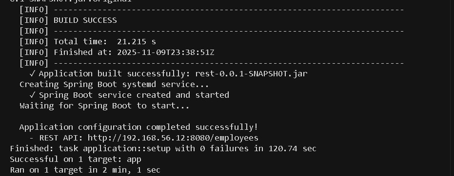

# CA4 - Configuration Management with Puppet Bolt

## Overview

Alternative implementation to Ansible using **Puppet Bolt** for configuration management.

Automates deployment of:
- **VM db:** H2 Database Server (TCP port 9092, Web Console 8082)
- **VM app:** Spring Boot REST Application (port 8080)
- **Both VMs:** PAM password policy, users, groups, and permissions

---

## Prerequisites

### Step 0.1: Install Puppet Bolt (Windows - Sem Chocolatey)

1. **Download o instalador:**
   - Vai a: https://puppet.com/docs/bolt/latest/bolt_installing.html
   - Clica em "Windows"
   - Download do ficheiro `.msi` (aprox. 60MB)
   - Exemplo: `puppet-bolt-x64-latest.msi`

2. **Instalar:**
   - Executa o ficheiro `.msi` que descarregaste
   - Clica "Next" → "Next" → "Install"
   - Se pedir permissões de administrador, aceita
   - Aguarda instalação (~2 minutos)
   - Clica "Finish"

3. **IMPORTANTE: Fecha e reabre o PowerShell**
   - O PowerShell precisa de ser reiniciado para reconhecer o comando `bolt`

4. **Verificar instalação:**
   ```powershell
   bolt --version
   ```
   
   Deves ver algo como:
   ```
   3.x.x
   ```

### Step 0.2: Verificar VMs do CA3 Part 2

1. **Ir para diretório do CA3:**
   ```powershell
   cd ..\..\CA3\PART_2_MULTIPASS
   ```

2. **Verificar status das VMs:**
   ```powershell
   vagrant status
   ```
   
   Deves ver:
   ```
   Current machine states:
   
   app                       running (virtualbox)
   db                        running (virtualbox)
   ```

3. **Se as VMs não estiverem running:**
   ```powershell
   vagrant up
   ```
   
   Aguarda que as VMs iniciem (~3-5 minutos)

4. **Verificar IPs das VMs:**
   ```powershell
   vagrant ssh app -c "ip addr show eth1 | grep 'inet '"
   vagrant ssh db -c "ip addr show eth1 | grep 'inet '"
   ```
   
   Expected:
   - app: 192.168.56.12
   - db: 192.168.56.13
   
   **Nota:** Se os IPs forem diferentes, precisas editar `puppet_bolt/inventory.yaml`

5. **Voltar para diretório CA4:**
   ```powershell
   cd ..\..\CA4\CA4_Part1_Puppet_Bolt
   ```

### Step 0.3: Verificar Conectividade SSH (Opcional mas Recomendado)

```powershell
# Testar SSH para VM app
ssh -i ..\..\CA3\PART_2_MULTIPASS\.vagrant\machines\app\virtualbox\private_key vagrant@192.168.56.12 "echo Connected to app"

# Testar SSH para VM db  
ssh -i ..\..\CA3\PART_2_MULTIPASS\.vagrant\machines\db\virtualbox\private_key vagrant@192.168.56.13 "echo Connected to db"
```

Se ambos responderem "Connected to ..." está tudo OK.

**Se der erro "Permission denied":** As chaves SSH podem estar com permissões erradas. No PowerShell:
```powershell
icacls "..\..\CA3\PART_2_MULTIPASS\.vagrant\machines\app\virtualbox\private_key" /inheritance:r /grant:r "$($env:USERNAME):R"
icacls "..\..\CA3\PART_2_MULTIPASS\.vagrant\machines\db\virtualbox\private_key" /inheritance:r /grant:r "$($env:USERNAME):R"
```

---

## Project Structure

```
CA4/CA4_Part1_Puppet_Bolt/
├── README.md                   # This file
├── puppet_bolt/               # Bolt project
│   ├── bolt-project.yaml
│   ├── inventory.yaml
│   ├── modules/
│   │   ├── common/           # Users, groups, PAM
│   │   ├── database/         # H2 Database
│   │   └── application/      # Spring Boot
│   ├── plans/
│   │   ├── deploy.pp
│   │   └── healthcheck.pp
│   └── tasks/
│       └── healthcheck/
├── ca2-part2/                # Spring Boot app
└── img/                      # Screenshots
```

---

## Step 1: Check Connectivity

```powershell
cd puppet_bolt
bolt command run 'echo "Connected to $(hostname)"' --targets all
```

Expected output:
```
Started on app...
Started on db...
Finished on app:
  STDOUT: Connected to app
Finished on db:
  STDOUT: Connected to db
Successful on 2 targets: app,db
```


---

## Step 2: Show Inventory

```powershell
bolt inventory show --targets all
```

Expected: Shows both VMs with SSH configuration.


---

## Step 3: Deploy Complete Infrastructure

```powershell
bolt plan run deploy --targets all
```

This executes:
1. **Common configuration** (both VMs)
   - Creates group `developers` (GID 3000)
   - Creates user `devuser` (UID 3000)
   - Configures PAM password policy
   - Configures account lockout policy

2. **Database VM** (db)
   - Downloads H2 Database v2.4.240
   - Configures TCP server (port 9092)
   - Configures web console (port 8082)
   - Creates systemd service

3. **Application VM** (app)
   - Clones Spring Boot repository
   - Builds with Gradle
   - Configures database connection
   - Creates systemd service

Duration: ~5-10 minutes


---

## Step 4: Verify Idempotency

Run deployment again:

```powershell
bolt plan run deploy --targets all
```

Second run should show **0 or minimal changes**.



---

## Step 5: Run Health Checks

```powershell
bolt plan run healthcheck --targets all
```

Verifies:
- H2 service running
- H2 TCP port 9092 listening
- Spring Boot service running
- Spring Boot HTTP endpoint responding


---

## Step 6: Verify Users and Groups

```powershell
bolt command run 'id devuser' --targets all
bolt command run 'getent group developers' --targets all
```

Expected:
```
devuser: uid=3000(devuser) gid=3000(developers) groups=3000(developers)
developers:x:3000:
```


---

## Step 7: Verify PAM Password Policy

```powershell
bolt command run 'cat /etc/security/pwquality.conf' --targets all
bolt command run 'cat /etc/security/faillock.conf' --targets all
```

Policy enforced:
- Minimum 12 characters
- At least 3 of 4 character classes
- Dictionary words rejected
- Username in password rejected
- Last 5 passwords remembered
- Account locked after 5 failed attempts for 10 minutes


---

## Step 8: Test Endpoints

Open in browser:
- Spring Boot: http://192.168.56.12:8080/employees
- H2 Console: http://192.168.56.13:8082


---

## Troubleshooting

### Connection Issues
```powershell
bolt inventory show --targets all
bolt command run 'uptime' --targets all
```

Se falhar:
- Verifica se as VMs estão running: `vagrant status` (no diretório CA3/PART_2_MULTIPASS)
- Verifica caminhos das chaves SSH no `inventory.yaml`
- Testa SSH manualmente (ver Step 0.3)

### Service Issues
```powershell
bolt command run 'systemctl status h2' --targets db
bolt command run 'systemctl status springboot' --targets app
bolt command run 'journalctl -u springboot -n 50' --targets app
```

Se o serviço não iniciar:
- Verifica logs: `journalctl -u <servico> -n 100`
- Verifica se as portas estão ocupadas: `ss -tln | grep -E ":(9092|8082|8080)"`
- Restart manual: `systemctl restart <servico>`

### Build Failures

```powershell
bolt command run 'cd /home/vagrant/app/complete && ./gradlew clean build --stacktrace' --targets app --run-as devuser
```

### "bolt: command not found"

Fechaste e reabriste o PowerShell após instalar o Bolt? Se não, faz isso.

Ou verifica se está no PATH:
```powershell
$env:PATH
```

Deve conter algo como `C:\Program Files\Puppet Labs\Bolt\bin`

---

## Checklist Final

Após completar todos os steps, verifica:

- [ ] VMs do CA3 Part 2 estão running
- [ ] Puppet Bolt instalado (`bolt --version` funciona)
- [ ] Conectividade testada (Step 1)
- [ ] Inventário mostra 2 VMs (Step 2)
- [ ] Deployment executado com sucesso (Step 3)
- [ ] Segunda execução mostra 0 mudanças (Step 4)
- [ ] Health checks passam (Step 5)
- [ ] User `devuser` e group `developers` existem (Step 6)
- [ ] PAM policy configurada (Step 7)
- [ ] Endpoints acessíveis no browser (Step 8)
- [ ] 9 screenshots tirados e guardados em `img/`

---

## Tempo Estimado

- **Prerequisites (Step 0):** 10-15 minutos
- **Step 1-2:** 5 minutos
- **Step 3 (primeira execução):** 8-12 minutos
- **Step 4-8:** 10-15 minutos
- **Total:** ~40-50 minutos

---

## Problemas Comuns

### 1. "Failed to connect to target"

**Causa:** VMs não estão running ou IPs incorretos

**Solução:**
```powershell
cd ..\..\CA3\PART_2_MULTIPASS
vagrant status
vagrant up  # se necessário
```

### 2. "Permission denied (publickey)"

**Causa:** Chaves SSH com permissões erradas

**Solução:**
```powershell
icacls "..\..\CA3\PART_2_MULTIPASS\.vagrant\machines\app\virtualbox\private_key" /inheritance:r /grant:r "$($env:USERNAME):R"
icacls "..\..\CA3\PART_2_MULTIPASS\.vagrant\machines\db\virtualbox\private_key" /inheritance:r /grant:r "$($env:USERNAME):R"
```

### 3. Serviços não iniciam

**Causa:** Portas já em uso ou erros de configuração

**Solução:**
```powershell
# Ver logs
bolt command run 'journalctl -u h2 -n 100' --targets db
bolt command run 'journalctl -u springboot -n 100' --targets app

# Verificar portas
bolt command run 'ss -tln | grep -E ":(9092|8082|8080)"' --targets all
```

### 4. Build Gradle falha

**Causa:** Falta de dependências ou problemas de rede

**Solução:**
```powershell
# Rebuild com mais detalhes
bolt command run 'cd /home/vagrant/app/complete && ./gradlew clean build --stacktrace --info' --targets app --run-as devuser
```

### 5. Idempotência não funciona (mostra mudanças na 2ª execução)

**Causa:** Isto é normal se for logo após a primeira execução e serviços ainda estarem a estabilizar

**Solução:** Aguarda 1-2 minutos e tenta novamente

---

## Requirements Compliance

- ✅ Deploy Spring Boot with configuration management (Puppet Bolt)
- ✅ Deploy H2 Database with configuration management (Puppet Bolt)
- ✅ Idempotent configurations (verified with 2nd run)
- ✅ PAM password policy (12 chars, 3 classes, dictionary, history, lockout)
- ✅ Group `developers` (GID 3000) and user `devuser` (UID 3000)
- ✅ Directory permissions 0750 (only developers group)
- ✅ Health checks (HTTP for app, TCP port for db)
- ✅ Inventory provided (`inventory.yaml`)

---

## Summary

Este tutorial guia-te através da implementação completa do CA4 usando Puppet Bolt:

1. **Instalação do zero** (sem Chocolatey)
2. **Verificação de prerequisites** (VMs, conectividade)
3. **Deployment automatizado** (users, PAM, H2, Spring Boot)
4. **Verificação de idempotência** (2ª execução)
5. **Validação completa** (health checks, endpoints)
6. **Screenshots** para relatório

Seguindo estes passos do início ao fim, consegues completar o CA4 com sucesso.

**Próximo passo:** Fazer commit com tag `ca4`

```powershell
git add CA4/
git commit -m "feat: Add CA4 Puppet Bolt implementation"
git tag ca4
git push origin main
git push origin ca4
```

