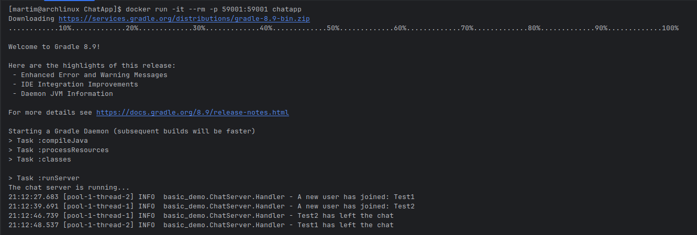
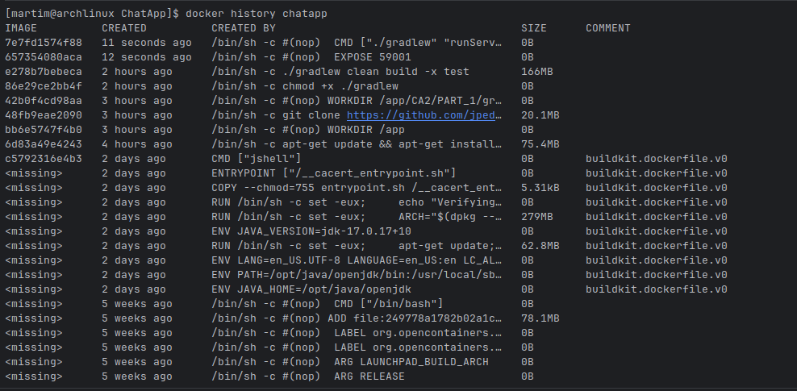
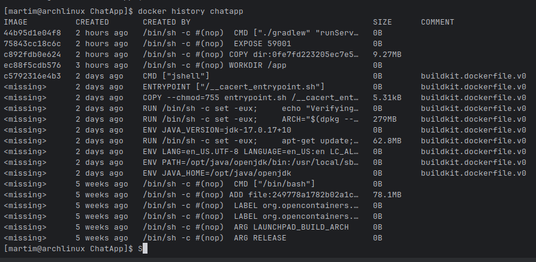
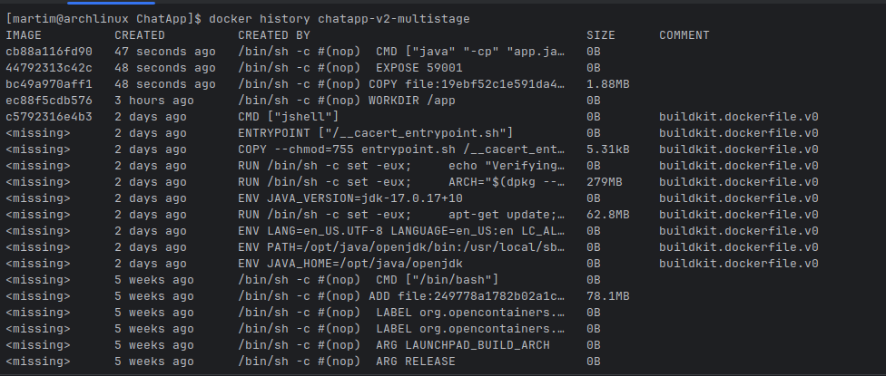

# Docker

Docker is a platform that allows developers to automate the deployment, scaling, and management of applications using containerization. Containers are lightweight, portable, and self-sufficient units that package an application and its dependencies together, ensuring consistency across different environments.

## Exercise Overview

This envolves in creating Docker images for the CA2  Gradle applications developed in PART 1 and PART 2.

1. Create a Dockerfile for the Chatter Application (PART 1).

It has two versions of the Dockerfile for the Chatter Application.

- Version 1: Build the server inside the Dockerfile — clone your repository and compile the application within the container.
- Version 2: Build the server on the host machine and copy the resulting JAR file into the Docker image.

It was created two diferent Dockerfiles, the v1.Dockerfile:
```Dockerfile
```

```bash
docker build -t chatter-app:latest -f v1.v1.multistage.Dockerfile .
```
The -t flag tags the image with the name chatter-app:latest, and the -f flag specifies the Dockerfile to use for the build.

Then we can run the Docker container using the following command:

```bash
docker run -it --rm -p 59001:59001  chatapp
```
In here, the -it flag allows for interactive terminal access, --rm ensures the container is removed after it stops, and -p maps port 59001 of the container to port 59001 on the host machine.




It was also created a v2.Dockerfile:

```Dockerfile
FROM eclipse-temurin:17-jdk

WORKDIR /app

COPY gradle_basic_demo-main/build/libs/basic_demo-0.1.0.jar app.jar

EXPOSE 59001

CMD ["java", "-cp", "app.jar", "basic_demo.ChatServerApp", "59001"]
```

For this was first built the application using the Gradle wrapper:

```bash
./gradlew clean build -x test
```

TO generate the JAR file.

Then it was builded the Docker image using the following command:
```bash
docker build -f v2.v1.multistage.Dockerfile -t chatapp-server-v2 .
```
In here, the -f flag specifies the Dockerfile to use (v2.Dockerfile), and the -t flag tags the image with the name chatapp-server-v2.

And then run the Docker image using the following command:

```bash
 docker run -it --rm -p 59001:59001 chatapp-server-v2
```
In here, the -it flag allows for interactive terminal access, --rm ensures the container is removed after it stops, and -p maps port 59001 of the container to port 59001 on the host machine.


2. Use docker history to compare the two images.

Using the docker history command, we can compare the two Docker images created for the Chatter Application.
```bash
docker history <image_id>
```

This command displays the history of an image, showing the layers that make up the image along with their sizes and creation times.


### Significant Docker Layers: `chatapp`

| Layer | Created | Size | Notes |
|-------|---------|------|-------|
| ./gradlew clean build -x test | 2 hours ago | 166MB | Builds the project inside the container |
| git clone ... | 3 hours ago | 20.1MB | Adds source code from the repository |
| apt-get install ... | 4 hours ago | 75.4MB | Installs Git and OS dependencies |
| Java JDK | 2 days ago | 279MB | Base JDK installation |
| Base OS | 5 weeks ago | 78.1MB | Operating system filesystem |
| CMD ["./gradlew", "runServer"] | 11 seconds ago | 0B | Runs the server inside the container |
| EXPOSE 59001 | 12 seconds ago | 0B | Metadata layer for the server port |


### Docker Image Analysis: `chatapp`

- **Largest contributions to image size:**
  - **Java JDK (~279 MB):** Base JDK installation is the single largest layer.
  - **Project build (~166 MB):** Running `./gradlew clean build` inside the container adds compiled classes, dependencies, and Gradle cache.
  - **Base OS (~78 MB) and OS packages (~75 MB):** Essential packages and the operating system add significant weight.

- **Minor contributions:**
  - **Git clone (~20 MB):** Adds source code.
  - **CMD and EXPOSE layers:** Metadata only (0B).

- **Key insight:**
  - Most of the image size comes from the **base image (JDK + OS)** rather than the application itself.
  - Building the project inside the container (single-stage) adds a large layer (~166 MB).
  - Using a **multi-stage build** would reduce image size by including only the JAR and JDK, leaving out Gradle, Git, and source code.




### Docker Layers: `chatapp-server-v2`

| Layer | Created | Size | Notes |
|-------|---------|------|-------|
| COPY JAR | About an hour ago | 1.88MB | Adds the prebuilt server JAR (`app.jar`) |
| CMD | About an hour ago | 0B | Runs the server inside the container |
| Java JDK | 2 days ago | 279MB | JDK installation from base image |
| OS packages | 2 days ago | 62.8MB | OS dependencies (ca-certificates, etc.) |
| Base OS | 5 weeks ago | 78.1MB | Operating system filesystem |


### Docker Image Size Analysis: 

- **Dockerfile contribution:** ~1.88 MB
  - COPY layer adds the prebuilt JAR (`app.jar`)
  - CMD layer runs the server: `java -cp app.jar basic_demo.ChatServerApp 59001`
  - EXPOSE and WORKDIR layers are metadata, 0B
- **Base image contribution:** ~420 MB
  - Java JDK installation: ~279 MB
  - OS packages (ca-certificates, etc.): ~62.8 MB
  - Base OS filesystem: ~78.1 MB
  - Minor scripts and environment setup: few kB
- **Key insight:**
  - Most of the image size comes from the base image
  - The application layer is very small
  - Using a prebuilt JAR keeps the image lightweight and efficient


By the comparison of the two images, it is possible to see that the second approach (building the JAR on the host and copying it into the image) results in a smaller and more efficient Docker image. This is because it avoids the overhead of installing build tools and dependencies inside the container, leading to a leaner final image.


## Multistage Builds

The v1.Dockerfile:

```Dockerfile

FROM eclipse-temurin:17-jdk AS builder

RUN apt-get update && apt-get install -y git && rm -rf /var/lib/apt/lists/*

WORKDIR /app

RUN git clone https://github.com/jpedroal11/cogsi2425-1211066-1250515-1181754-1220638.git .

WORKDIR /app/CA2/PART_1/gradle_basic_demo-main

RUN chmod +x ./gradlew

RUN ./gradlew clean build -x test

FROM eclipse-temurin:17-jdk

WORKDIR /app

COPY --from=builder /app/CA2/PART_1/gradle_basic_demo-main /app

EXPOSE 59001

CMD ["./gradlew", "runServer"]
```

In here it is created a multi-stage build Dockerfile:

- In the first stage, it uses the Eclipse Temurin JDK 17 image as the base image and installs Git.
- It then clones the repository containing the Gradle chat application, navigates to the appropriate directory, makes the Gradle wrapper executable, and builds the application while skipping tests.
- In the second stage, it again uses the Eclipse Temurin JDK 17 image as the base image, sets the working directory, copies the built application from the first stage, exposes port 59001, and sets the default command to run the server using the Gradle wrapper.


### Docker Layers: `chatapp`

| Layer        | Created     | Created By                     | Size   | Notes                                                                      |
|--------------|-------------|--------------------------------|--------|----------------------------------------------------------------------------|
| 44b95d1e04f8 | 2 hours ago | CMD ["./gradlew", "runServer"] | 0B     | Runs your server inside the container.                                     |
| c892fdb0e624 | 2 hours ago | COPY dir:…                     | 9.27MB | Copies the Gradle project (source + wrapper + configs) into the container. |
| <missing>    | 2 days ago  | RUN … JDK installation         | 279MB  | Installs Java JDK in the base image.                                       |
| <missing>    | 2 days ago  | RUN … OS package installation  | 62.8MB | Installs OS dependencies like ca-certificates.                             |
| <missing>    | 5 weeks ago | ADD … Base OS filesystem       | 78.1MB | Base OS layer (Debian/Ubuntu).                                             |

### Docker Image Size Analysis

- **Dockerfile contribution:** ~9.3 MB
  - Mostly the source code and Gradle wrapper
- **Base image contribution:** ~420 MB
  - Includes Java JDK (~279 MB)
  - OS packages (~63 MB)
  - Operating system (~78 MB)
- **Key insight:**
  - Most of the image size comes from the base image
  - The application itself adds very little
  - Keeping Dockerfile layers small (like Version 2 with only the JAR) results in a lighter, more efficient image

    


### Docker Layers: `chatapp-server-v2`


### Significant Docker Layers: `

| Layer | Created | Size | Notes |
|-------|---------|------|-------|
| COPY JAR | 48 seconds ago | 1.88MB | Copies the built JAR from the builder stage |
| Java JDK | 2 days ago | 279MB | Base JDK installation |
| apt-get install ... | 2 days ago | 62.8MB | OS packages and dependencies |
| Base OS | 5 weeks ago | 78.1MB | Operating system filesystem |
| CMD ["java", "-cp", "app.jar", ...] | 47 seconds ago | 0B | Runs the server from the JAR |
| EXPOSE 59001 | 48 seconds ago | 0B | Metadata layer for server port |


### Docker Image Analysis: 

- **Largest contributors to image size:**
  - **Java JDK (~279 MB):** Base Java installation.
  - **OS packages (~62.8 MB) and Base OS (~78.1 MB):** Required system libraries.

- **Application contribution:**
  - **JAR file (~1.88 MB):** Your built application is very small compared to the base image.

- **Minor layers:**
  - CMD and EXPOSE layers are metadata (0B), no impact on size.

- **Key insight:**
  - Multi-stage build significantly reduces image size by copying **only the JAR** into the runtime image.
  - Most of the image size comes from the base image, not your project.

- **Efficiency:**
  - Multi-stage builds make the runtime image **smaller and cleaner**, improving deployment speed.
  - Single-stage builds that include the build environment (Gradle, source code) produce **heavier images**.
    


