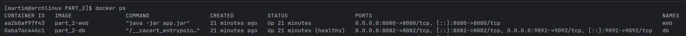
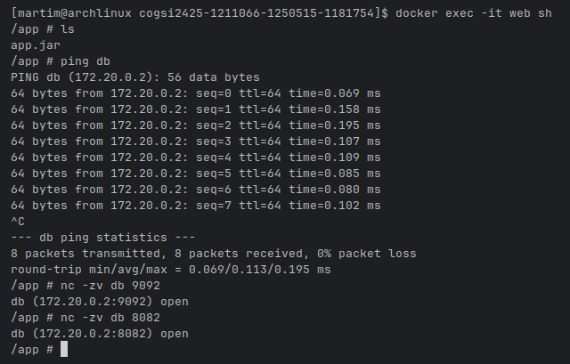
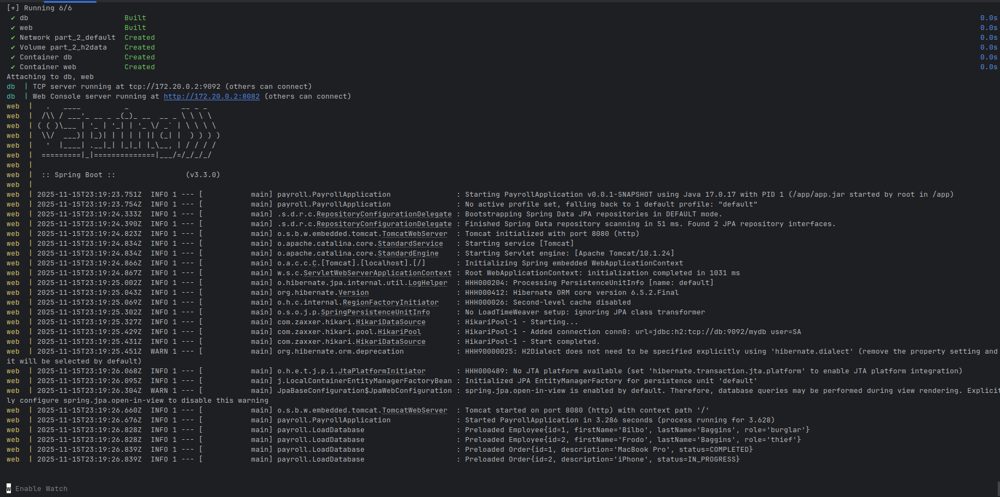
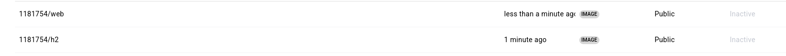

## Docker Part 2 - Docker Compose

This part envolves  to replicate the work done in CA3 Part 2 using Docker and Docker Compose to create a multi-container environment. The Spring Boot application and H2 database will run in separate Docker containers, simulating a microservices architecture.


1. Create Dockerfiles for both the Spring Boot application and the H2 database.

- **Dockerfile for H2 Database (h2-db/Dockerfile):**
```Dockerfile
FROM eclipse-temurin:17-jre-alpine

ENV H2_VERSION=2.2.224

RUN apk add --no-cache netcat-openbsd

RUN wget https://repo1.maven.org/maven2/com/h2database/h2/${H2_VERSION}/h2-${H2_VERSION}.jar -O /opt/h2.jar

RUN mkdir -p /opt/h2-data

EXPOSE 8082 9092

WORKDIR /opt


CMD ["java", "-cp", "/opt/h2.jar", "org.h2.tools.Server", \
     "-tcp", "-tcpAllowOthers", "-tcpPort", "9092", \
     "-web", "-webAllowOthers", "-webPort", "8082", \
     "-baseDir", "/opt/h2-data", \
     "-ifNotExists"]

```

In here we create a Docker image based on Eclipse Temurin JRE 17 Alpine. We download the H2 database jar file, expose the necessary ports, and set the command to run the H2 server in TCP and web modes.


- **Dockerfile for Spring Boot Application (spring-boot-app/Dockerfile):**
```Dockerfile

FROM gradle:8.6-jdk17 AS builder
WORKDIR /app
COPY ca2-part2/app/ ./
RUN gradle bootJar --no-daemon

FROM eclipse-temurin:17-jre-alpine
WORKDIR /app
COPY --from=builder /app/build/libs/app-0.0.1-SNAPSHOT.jar app.jar
EXPOSE 8080
ENTRYPOINT ["java", "-jar", "app.jar"]

```
In here we use a multi-stage build. The first stage uses the Gradle image to build the Spring Boot application, and the second stage uses Eclipse Temurin JRE 17 Alpine to run the built jar file.

2. Create a Docker Compose file to define and run the multi-container application.

- **docker-compose.yml:**
```yaml

services:
  db:
    build:
      context: .
      dockerfile: db.Dockerfile
    container_name: db
    ports:
      - "9092:9092"
      - "8082:8082"
    volumes:
      - h2data:/opt/h2-data
    healthcheck:
      test: ["CMD", "sh", "-c", "nc -z localhost 9092 || exit 1"]
      interval: 5s
      timeout: 3s
      retries: 5
      start_period: 10s

  web:
    build:
      context: .
      dockerfile: web.Dockerfile
    container_name: web
    depends_on:
      db:
        condition: service_healthy
    environment:
      SPRING_DATASOURCE_URL: jdbc:h2:tcp://db:9092/mydb
      SPRING_DATASOURCE_USERNAME: sa
      SPRING_DATASOURCE_PASSWORD:
      SERVER_PORT: 8080
    ports:
      - "8080:8080"
    restart: on-failure

volumes:
  h2data:
```
In here we define two services: `db` for the H2 database and `web` for the Spring Boot application. The `web` service depends on the `db` service being healthy before starting. We also set environment variables for the Spring Boot application to connect to the H2 database.

There is also enviorment variable mapping to the application.properties file.

- **application.properties:**

```yaml
spring.datasource.url=${SPRING_DATASOURCE_URL}
spring.datasource.username=${SPRING_DATASOURCE_USERNAME}
spring.datasource.password=${SPRING_DATASOURCE_PASSWORD}
spring.datasource.driver-class-name=org.h2.Driver
spring.jpa.database-platform=org.hibernate.dialect.H2Dialect
spring.jpa.hibernate.ddl-auto=update
server.port=${SERVER_PORT}
```
This are injected from the docker-compose.yml file.

The database data is persisted using a Docker volume named `h2data`.
```yaml

volumes:
    h2data:
```

There is health check for the database service to ensure it is ready before the Spring Boot application starts.
```yaml

healthcheck:
    test: ["CMD", "sh", "-c", "nc -z localhost 9092 || exit 1"]
    interval: 5s
    timeout: 3s
    retries: 5
    start_period: 10s
 ```

And in the web service:
```yaml
    depends_on:
      db:
        condition: service_healthy
```
To ensure that the web service only starts after the database service is healthy.

3. Build and run the Docker containers using Docker Compose.

- To build and start the containers, run the following command in the directory containing the `docker-compose.yml` file:
```bash
docker-compose up --build
```
- This command builds the Docker images and starts the containers as defined in the Docker Compose file.
- The Spring Boot application  is accessible at `http://localhost:8080`, and the H2 database web console at `http://localhost:8082`.

Confirm both containers are running:



Confirm web can access the database:



In here we can see the Spring Boot application connected to the H2 database running in separate Docker containers:




4. Push the Docker images to Docker Hub .
- Build the Docker images:
```bash
docker build -f db.Dockerfile -t h2:v1.0.0 .
docker build -f web.Dockerfile -t web:v1.0.0 .
```


- Tag the images with your Docker Hub username:
```bash
docker tag h2:v1.0.0 1181754/h2:latest
 docker tag web:v1.0.0 1181754/web:latest
 ``` 
- Then, push the images to Docker Hub:
```bash
docker push 1181754/h2:v1.0.0
docker push 1181754/web:v1.0.0
```
Docker Hub Repositories:

- H2 Database Image: https://hub.docker.com/repository/docker/1181754/h2

- Spring Boot Application Image: https://hub.docker.com/repository/docker/1181754/web



6. Clean up

- To stop and remove the containers, networks, and volumes created by Docker Compose, run:
```bash
docker-compose down -v
```
This command stops the containers and removes the associated resources, including the named volume `h2data` used for persisting database data.


